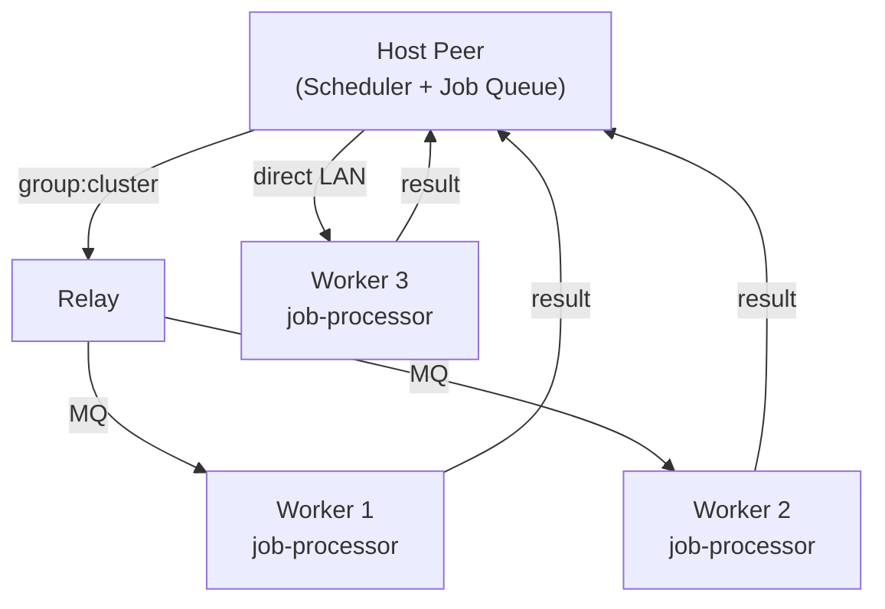
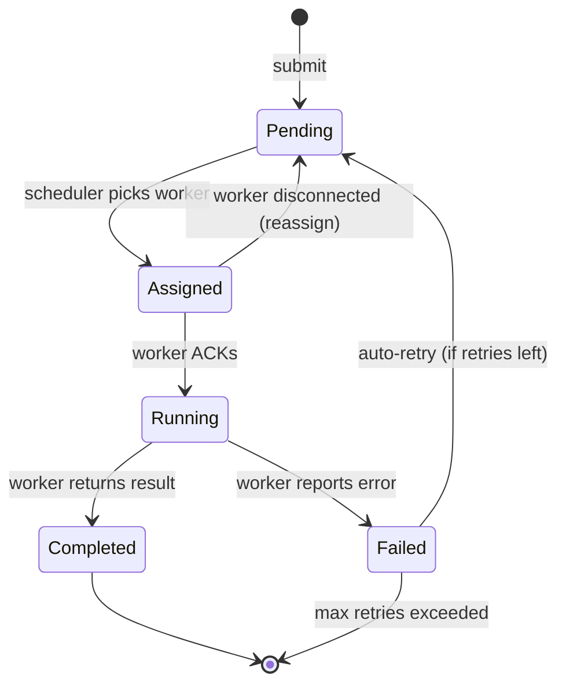

# Clustered Computations

Distributed job queue built on the existing group + MQ infrastructure. A host peer creates a **cluster group**, connected peers join as workers, and jobs are dispatched over MQ with results flowing back to the host.

## Architecture



### Group-based clustering

Uses the existing group API with `app_type: "cluster"`:

- **Host** creates a cluster group → becomes the scheduler
- **Workers** join the group (via invite or manual join) → register as available compute nodes
- **Host** tracks worker state: idle, busy, failed, disconnected
- Group membership = cluster membership. Leave group = leave cluster.

### Job lifecycle



### MQ topic map

All cluster communication flows through the unified MQ bus:

| Topic | Direction | Payload | Purpose |
|-------|-----------|---------|---------|
| `group:{gid}:job:assign` | host → worker | `{job_id, type, payload, timeout_s}` | Assign a job to a specific worker |
| `group:{gid}:job:ack` | worker → host | `{job_id, status: "running"}` | Worker confirms job receipt |
| `group:{gid}:job:result` | worker → host | `{job_id, status, result, elapsed_ms}` | Job completed or failed |
| `group:{gid}:job:progress` | worker → host | `{job_id, pct, msg}` | Optional progress reporting |
| `group:{gid}:worker:status` | worker → host | `{capacity, running_jobs, load}` | Heartbeat / capacity report |
| `group:{gid}:job:cancel` | host → worker | `{job_id}` | Cancel a running job |

Standard group topics (`join`, `leave`, `welcome`, `members`) handle membership automatically.

## Components

### 1. `internal/cluster/` — Core package

**Zero imports from other internal/ packages** (same isolation pattern as `internal/call/`). Communicates via interfaces.

#### `queue.go` — Job Queue (host side)

```go
type Job struct {
    ID        string         `json:"id"`
    Type      string         `json:"type"`      // job type identifier
    Payload   map[string]any `json:"payload"`    // input data
    Priority  int            `json:"priority"`   // 0 = normal, higher = urgent
    TimeoutS  int            `json:"timeout_s"`  // max execution time
    MaxRetry  int            `json:"max_retry"`  // retry count on failure
    CreatedAt time.Time      `json:"created_at"`
}

type JobState struct {
    Job       Job            `json:"job"`
    Status    string         `json:"status"`    // pending, assigned, running, completed, failed
    WorkerID  string         `json:"worker_id"` // assigned peer ID
    Result    map[string]any `json:"result,omitempty"`
    Error     string         `json:"error,omitempty"`
    Retries   int            `json:"retries"`
    StartedAt time.Time      `json:"started_at,omitempty"`
    DoneAt    time.Time      `json:"done_at,omitempty"`
    ElapsedMs int64          `json:"elapsed_ms,omitempty"`
}

type Queue struct { ... }

func NewQueue() *Queue
func (q *Queue) Submit(job Job) string           // returns job ID
func (q *Queue) Cancel(jobID string) error
func (q *Queue) NextPending() *Job               // scheduler pulls next job
func (q *Queue) Assign(jobID, workerID string)
func (q *Queue) Complete(jobID string, result map[string]any)
func (q *Queue) Fail(jobID string, errMsg string) // may re-queue if retries left
func (q *Queue) State() []JobState                // full queue snapshot
func (q *Queue) Stats() QueueStats                // summary counters
```

#### `scheduler.go` — Scheduler (host side)

```go
type Scheduler struct { ... }

func NewScheduler(queue *Queue, send SendFunc) *Scheduler
func (s *Scheduler) AddWorker(peerID string)
func (s *Scheduler) RemoveWorker(peerID string)
func (s *Scheduler) UpdateWorkerStatus(peerID string, status WorkerStatus)
func (s *Scheduler) Run(ctx context.Context)      // main loop: match jobs to workers
func (s *Scheduler) Workers() []WorkerInfo
```

Scheduling strategy (v1): **round-robin with capacity check**. Worker reports capacity in heartbeat; scheduler only assigns if `running_jobs < capacity`. Future: weighted by load, job-type affinity, locality-aware.

#### `worker.go` — Worker (member side)

```go
type Worker struct { ... }

func NewWorker(processor Processor) *Worker
func (w *Worker) HandleJob(job Job) (map[string]any, error)
func (w *Worker) Cancel(jobID string)
func (w *Worker) Status() WorkerStatus
```

#### `processor.go` — Job Processor interface

```go
// Processor executes jobs. Implementations can be in-process Go, a child
// process (C binary over stdin/stdout), a WASM module, or an HTTP call.
type Processor interface {
    // Execute runs a job and returns the result. Called in its own goroutine.
    // The context is cancelled if the job times out or is cancelled.
    Execute(ctx context.Context, jobType string, payload map[string]any) (map[string]any, error)

    // Types returns the job types this processor handles.
    Types() []string

    // Close shuts down the processor (kills child process, etc.)
    Close() error
}
```

#### `processor_exec.go` — External binary processor

```go
// ExecProcessor runs an external binary for each job.
// Communication: JSON over stdin/stdout.
// The binary receives {"type": "...", "payload": {...}} on stdin,
// writes {"result": {...}} or {"error": "..."} to stdout.
// Stderr is captured for logging.
type ExecProcessor struct {
    BinaryPath string
    // ... process management, pooling
}
```

Protocol for the external binary:

```
→ stdin:  {"job_id":"abc","type":"render","payload":{"scene":"test.blend"}}
← stdout: {"status":"progress","pct":45,"msg":"rendering frame 12/27"}
← stdout: {"status":"progress","pct":89,"msg":"rendering frame 24/27"}
← stdout: {"status":"done","result":{"output_path":"/tmp/render_abc.mp4"}}
```

Or on failure:

```
← stdout: {"status":"error","error":"out of memory"}
```

The binary can be:
- **Long-running daemon** (started once, handles multiple jobs via newline-delimited JSON)
- **One-shot** (started per job, exits after result)

Configurable via `"mode": "daemon"` or `"mode": "oneshot"` in cluster config.

### 2. `internal/cluster/handler.go` — Group event handler

Implements `group.Handler` interface. Registered with `grpMgr.RegisterHandler("cluster", clusterHandler)`.

```go
type ClusterHandler struct {
    scheduler *Scheduler  // nil on worker peers
    worker    *Worker     // nil on host peer
}

func (h *ClusterHandler) HandleGroupEvent(evt *group.Event) {
    // Route MQ messages to scheduler or worker based on topic suffix.
}
```

### 3. `internal/app/cluster.go` — Wiring

Same pattern as `internal/app/listen.go`:

- Creates `cluster.Scheduler` or `cluster.Worker` depending on role
- Adapts MQ send/subscribe for the cluster package
- Registers the group handler
- Wires up API routes

### 4. API endpoints

| Method | Path | Description |
|--------|------|-------------|
| `POST` | `/api/cluster/submit` | Submit a job to the queue |
| `POST` | `/api/cluster/cancel` | Cancel a pending/running job |
| `GET` | `/api/cluster/jobs` | List all jobs with state |
| `GET` | `/api/cluster/workers` | List workers with status |
| `GET` | `/api/cluster/stats` | Queue statistics |

These only work on the host peer (scheduler). Workers don't need their own API — everything flows through MQ.

### 5. Topology integration

The topology graph (`GET /api/topology`) can be extended to show cluster state:

- Worker peers annotated with `cluster: "idle"` / `"busy"` / `"offline"`
- Job flow visualized as animated edges
- Color-coded by worker utilization

### 6. Configuration

In `config.json` (viewer section):

```json
{
  "cluster": {
    "enabled": true,
    "processor": {
      "binary": "/usr/local/bin/my-compute",
      "mode": "daemon",
      "max_concurrent": 4,
      "timeout_s": 300
    }
  }
}
```

Workers configure what binary to run locally. The host doesn't need to know — it just dispatches jobs and collects results.

## Implementation phases

### Phase 1: Core queue + scheduler

- [ ] `internal/cluster/` package: `Queue`, `Scheduler`, `Worker`, `Processor` interface
- [ ] `internal/cluster/handler.go`: group event handler
- [ ] `internal/app/cluster.go`: wiring with MQ adapter
- [ ] `grpMgr.RegisterHandler("cluster", ...)` in `run.go`
- [ ] Basic round-robin scheduling
- [ ] Unit tests for queue state machine

### Phase 2: API + UI

- [ ] API endpoints: submit, cancel, jobs, workers, stats
- [ ] Swagger annotations
- [ ] Cluster dashboard page (or section in existing UI)
- [ ] Job submission form (type + JSON payload)
- [ ] Live job status via MQ → store → watchers

### Phase 3: External processor

- [ ] `ExecProcessor` — stdin/stdout JSON protocol
- [ ] Daemon mode (long-running) and oneshot mode
- [ ] Process lifecycle: start, health check, restart on crash
- [ ] Stderr capture → cluster logs
- [ ] Progress reporting pipeline

### Phase 4: Scheduling improvements

- [ ] Capacity-aware scheduling (worker reports load)
- [ ] Job-type affinity (worker declares supported types)
- [ ] Priority queue (urgent jobs skip ahead)
- [ ] Timeout enforcement + automatic reassignment
- [ ] Retry with exponential backoff

### Phase 5: Topology + observability

- [ ] Extend `/api/topology` with cluster annotations
- [ ] Topology graph: color workers by utilization
- [ ] Job flow animation on edges
- [ ] Cluster-specific log tab filter
- [ ] Metrics: throughput, latency percentiles, failure rate

## Design decisions

**Why groups, not a custom protocol?**
Groups already handle membership, join/leave lifecycle, MQ routing, and persistence. Building clustering on top means we get reconnection, invitation flow, and the existing UI for free. The `app_type: "cluster"` handler pattern is proven by listen/template/files subsystems.

**Why a separate binary for compute?**
Go is the orchestration layer — scheduling, MQ, API, lifecycle. The actual computation may need different languages, libraries, or runtimes (ML inference in Python/C, rendering in C++, data processing with custom tools). The stdin/stdout JSON protocol is universal: any language can implement it. The goop2 binary stays lean.

**Why host-centric scheduling?**
Simpler than consensus-based distributed scheduling. The host has full visibility of the queue and all worker states. Workers are stateless from the cluster's perspective — they execute what they're told. If the host goes down, the cluster is down (same as groups today). Future: leader election for HA.

**Why not gRPC / HTTP between peers?**
MQ is already the event bus. Adding another transport for cluster messages would violate the single-bus principle. MQ gives us: delivery guarantees (ACK), topic routing, the unified log for debugging, and SSE bridging to the browser for live updates. Everything traces by topic name.
