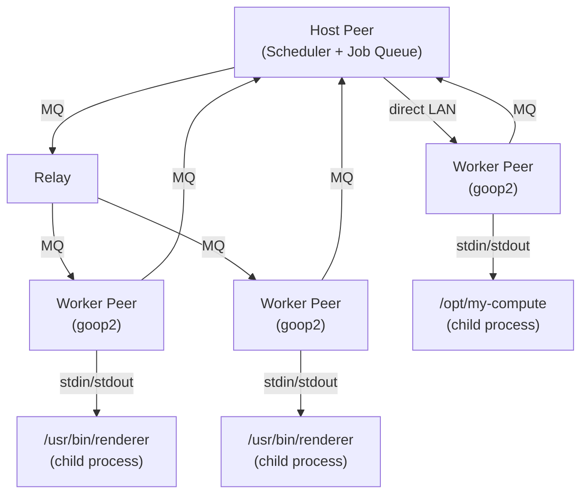
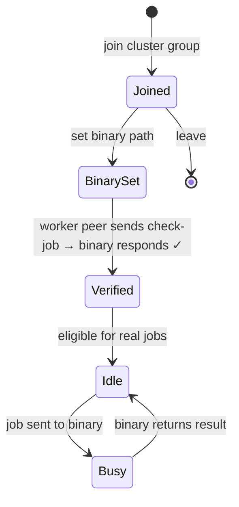
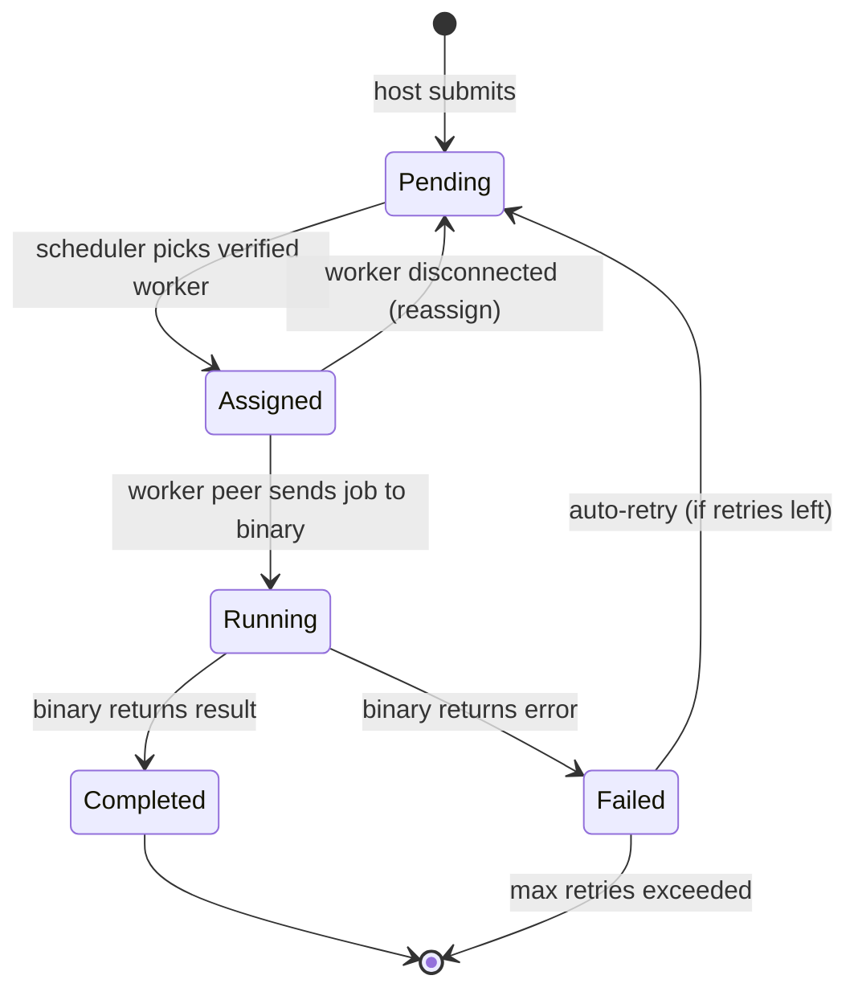

# Clustered Computations

Distributed job queue built on the existing group + MQ infrastructure. A host peer creates a **cluster group**, connected peers join as workers, and jobs are dispatched over MQ. Each worker peer sets a local binary path — the binary is a child process that speaks the goop2 cluster JSON protocol over stdin/stdout. Same pattern as file groups where a peer sets a shared folder path.

## Architecture


```mermaid
graph TB
    Host["Host Peer<br/>(Scheduler + Job Queue)"]
    R["Relay"]
    W1["Worker Peer<br/>(goop2)"]
    W2["Worker Peer<br/>(goop2)"]
    W3["Worker Peer<br/>(goop2)"]
    B1["/usr/bin/renderer<br/>(child process)"]
    B2["/usr/bin/renderer<br/>(child process)"]
    B3["/opt/my-compute<br/>(child process)"]

    Host -->|MQ| R
    R -->|MQ| W1
    R -->|MQ| W2
    Host -->|"direct LAN"| W3

    W1 -->|"stdin/stdout"| B1
    W2 -->|"stdin/stdout"| B2
    W3 -->|"stdin/stdout"| B3

    W1 -->|MQ| Host
    W2 -->|MQ| Host
    W3 -->|MQ| Host
```

The worker peer (goop2) is in full control. It starts the binary, sends jobs on stdin, reads results from stdout. The binary is a child process — it doesn't connect to anything, it doesn't poll, it doesn't know about MQ or the network. It just reads JSON, does work, writes JSON.

### Worker lifecycle


```mermaid
stateDiagram-v2
    [*] --> Joined: join cluster group
    Joined --> BinarySet: set binary path
    BinarySet --> Verified: worker peer sends check-job → binary responds ✓
    Verified --> Idle: eligible for real jobs
    Idle --> Busy: job sent to binary
    Busy --> Idle: binary returns result
    Joined --> [*]: leave
```

1. **Worker peer joins** the cluster group (just membership, like any group)
2. **Worker peer sets binary path** — points to a local executable (like setting a folder path in file groups)
3. **Worker peer sends check-job** to the binary on stdin — validates it speaks the goop2 cluster JSON protocol
4. **Binary responds** with types/version/capacity → worker peer notifies host via MQ → scheduler marks worker as verified
5. **Check fails** → worker stays `joined`, host sees "not verified", no jobs dispatched

A worker peer with no binary set, or a binary that hasn't passed the check-job, is invisible to the scheduler.

### The binary protocol

The binary is a child process. The worker peer (goop2) talks to it over stdin/stdout using newline-delimited JSON.

**Worker peer sends on stdin:**
```json
{"job_id":"abc","type":"render","payload":{"scene":"test.blend","frame":12}}
```

**Binary writes to stdout — progress (optional, zero or more):**
```json
{"status":"progress","pct":45,"msg":"rendering frame 12/27"}
{"status":"progress","pct":89,"msg":"rendering frame 24/27"}
```

**Binary writes to stdout — final result (exactly one):**
```json
{"status":"done","result":{"output_path":"/tmp/render_abc.mp4"}}
```

**Or on failure:**
```json
{"status":"error","error":"out of memory"}
```

That's the entire protocol. Read JSON from stdin, write JSON to stdout. Any language can implement this.

### Check-job protocol

The worker peer sends a check-job before trusting the binary with real work:

**Worker peer sends on stdin:**
```json
{"job_id":"__check__","type":"__check__","payload":{}}
```

**Binary responds on stdout:**
```json
{"status":"done","result":{"types":["render","transcode"],"version":"1.0","capacity":2}}
```

The check-job validates:
- Binary starts and reads stdin correctly
- Binary speaks the JSON protocol
- Binary reports what job types it supports (for type affinity)
- Binary reports how many concurrent jobs it can handle (for capacity scheduling)

A binary that doesn't understand `type: "__check__"` can just return a generic `{"status":"done","result":{}}` — the point is proving it speaks the protocol.

### Binary modes

- **Oneshot** (default): worker peer starts the binary per job, binary exits after result. Simple, stateless. Good for short jobs.
- **Daemon**: worker peer starts the binary once, sends multiple jobs over stdin as newline-delimited JSON. Binary stays running. More efficient for jobs with expensive startup (loading ML models, connecting to databases). Worker peer restarts the binary if it crashes.

### Group-based clustering

Uses the existing group API with `app_type: "cluster"`:

- **Host** creates a cluster group → becomes the scheduler
- **Workers** join the group (via invite or manual join) → set binary path → binary gets checked
- **Host** tracks worker state: joined, verified, idle, busy, disconnected
- Group membership = cluster membership. Leave group = leave cluster.

### Job lifecycle


```mermaid
stateDiagram-v2
    [*] --> Pending: host submits
    Pending --> Assigned: scheduler picks verified worker
    Assigned --> Running: worker peer sends job to binary
    Running --> Completed: binary returns result
    Running --> Failed: binary returns error
    Failed --> Pending: auto-retry (if retries left)
    Assigned --> Pending: worker disconnected (reassign)
    Completed --> [*]
    Failed --> [*]: max retries exceeded
```

### End-to-end flow

```
Host                         Worker Peer (goop2)                Binary (child process)
  |                               |                                  |
  |                               |--- start binary --------------->|
  |                               |--- stdin: check-job ----------->|
  |                               |<-- stdout: {ok, types} ---------|
  |<-- MQ worker:verified --------|   (binary verified)             |
  |                               |                                  |
  |--- MQ job:assign ------------>|                                  |
  |<-- MQ job:ack ----------------|                                  |
  |                               |--- stdin: {job} --------------->|
  |                               |<-- stdout: {progress} ----------|
  |<-- MQ job:progress -----------|                                  |
  |                               |<-- stdout: {progress} ----------|
  |<-- MQ job:progress -----------|                                  |
  |                               |<-- stdout: {done, result} ------|
  |<-- MQ job:result -------------|                                  |
  |                               |                                  |
  |   (next job when ready)       |   (waits for stdin in daemon    |
  |                               |    mode, or exits in oneshot)    |
```

### MQ topic map

All host ↔ worker peer communication flows through the unified MQ bus. The binary never sees MQ.

| Topic | Direction | Payload | Purpose |
|-------|-----------|---------|---------|
| `cluster:{gid}:job:assign` | host → worker peer | `{job_id, type, payload, timeout_s}` | Assign a job to a verified worker |
| `cluster:{gid}:job:ack` | worker peer → host | `{job_id}` | Worker received the job |
| `cluster:{gid}:job:result` | worker peer → host | `{job_id, status, result, error}` | Binary completed or failed |
| `cluster:{gid}:job:progress` | worker peer → host | `{job_id, percent, message}` | Progress from binary stdout |
| `cluster:{gid}:job:cancel` | host → worker peer | `{job_id}` | Cancel — worker peer kills binary |
| `cluster:{gid}:worker:verified` | worker peer → host | `{ok, types, version, capacity}` | Check-job result |
| `cluster:{gid}:worker:status` | worker peer → host | `{status, capacity}` | Heartbeat |

Standard group topics (`join`, `leave`, `welcome`, `members`) handle membership automatically.

## Components

### 1. `internal/cluster/` — Core package

**Zero imports from other internal/ packages** (same isolation pattern as `internal/call/`). Communicates via `SendFunc` and `SubscribeFunc` adapters.

#### `types.go` — Shared types

```go
type SendFunc func(peerID, topic string, payload any) error
type SubscribeFunc func(fn func(from, topic string, payload any)) func()

type Job struct {
    ID       string         `json:"id"`
    Type     string         `json:"type"`
    Payload  map[string]any `json:"payload,omitempty"`
    Priority int            `json:"priority"`
    TimeoutS int            `json:"timeout_s"`
    MaxRetry int            `json:"max_retry"`
}

type JobState struct {
    Job         Job            `json:"job"`
    Status      JobStatus      `json:"status"`     // pending, assigned, running, completed, failed, cancelled
    WorkerID    string         `json:"worker_id,omitempty"`
    Result      map[string]any `json:"result,omitempty"`
    Error       string         `json:"error,omitempty"`
    Progress    int            `json:"progress,omitempty"`
    ProgressMsg string         `json:"progress_msg,omitempty"`
    Retries     int            `json:"retries"`
    CreatedAt   time.Time      `json:"created_at"`
    StartedAt   time.Time      `json:"started_at,omitzero"`
    DoneAt      time.Time      `json:"done_at,omitzero"`
    ElapsedMs   int64          `json:"elapsed_ms,omitempty"`
}

type WorkerInfo struct {
    PeerID      string       `json:"peer_id"`
    Status      WorkerStatus `json:"status"`        // joined, verified, idle, busy, offline
    BinaryPath  string       `json:"binary_path"`
    BinaryMode  string       `json:"binary_mode"`   // "oneshot" or "daemon"
    Verified    bool         `json:"verified"`
    JobTypes    []string     `json:"job_types,omitempty"` // from check-job
    Capacity    int          `json:"capacity"`
    RunningJobs int          `json:"running_jobs"`
    LastSeen    time.Time    `json:"last_seen"`
}

type QueueStats struct {
    Pending   int `json:"pending"`
    Running   int `json:"running"`
    Completed int `json:"completed"`
    Failed    int `json:"failed"`
    Workers   int `json:"workers"`
}
```

#### `queue.go` — Job Queue (host side)

```go
func NewQueue() *Queue
func (q *Queue) Submit(job Job) string
func (q *Queue) Cancel(jobID string) error
func (q *Queue) NextPending() *Job                  // highest priority first
func (q *Queue) Assign(jobID, workerID string)
func (q *Queue) MarkRunning(jobID string)
func (q *Queue) Complete(jobID string, result map[string]any)
func (q *Queue) Fail(jobID string, errMsg string)   // re-queues if retries remain
func (q *Queue) UpdateProgress(jobID string, pct int, msg string)
func (q *Queue) Get(jobID string) (JobState, bool)
func (q *Queue) State() []JobState
func (q *Queue) Stats() QueueStats
func (q *Queue) WorkerJobIDs(workerID string) []string
```

#### `scheduler.go` — Scheduler (host side)

```go
func NewScheduler(queue *Queue, send SendFunc) *Scheduler
func (s *Scheduler) AddWorker(peerID string)
func (s *Scheduler) RemoveWorker(peerID string)
func (s *Scheduler) SetWorkerVerified(peerID string, ok bool, types []string, capacity int)
func (s *Scheduler) UpdateWorkerStatus(peerID string, status WorkerStatus)
func (s *Scheduler) Run(ctx context.Context, groupID string)
func (s *Scheduler) Workers() []WorkerInfo
```

Only dispatches to workers where `verified == true` and `running_jobs < capacity`.

#### `worker.go` — Worker (manages binary child process)

The worker peer starts the binary, pipes jobs to stdin, reads results from stdout, and relays everything to the host via MQ.

```go
func NewWorker(send SendFunc, groupID string) *Worker
func (w *Worker) SetBinary(path, mode string) error      // set path + mode, start if daemon
func (w *Worker) BinaryPath() string
func (w *Worker) RunCheckJob() (types []string, version string, capacity int, err error)
func (w *Worker) ExecuteJob(hostPeerID string, job Job)   // send to binary stdin, read stdout
func (w *Worker) Cancel(jobID string)                     // kill binary (oneshot) or send cancel
func (w *Worker) Status() WorkerStatus
func (w *Worker) RunningCount() int
func (w *Worker) Close()                                  // kill daemon binary if running
```

#### `exec.go` — Binary process management

```go
type BinaryRunner struct {
    Path string
    Mode string // "oneshot" or "daemon"
}

func (r *BinaryRunner) Start() error                    // start daemon process
func (r *BinaryRunner) SendJob(job Job) error           // write JSON to stdin
func (r *BinaryRunner) ReadLines() <-chan BinaryOutput   // stream stdout lines
func (r *BinaryRunner) Kill(jobID string)               // kill oneshot / signal daemon
func (r *BinaryRunner) Close()                          // stop daemon
```

#### `manager.go` — Unified entry point

```go
func New(selfID string, send SendFunc, subscribe SubscribeFunc) *Manager

// Lifecycle
func (m *Manager) CreateCluster(groupID string) error
func (m *Manager) JoinCluster(groupID string) error
func (m *Manager) LeaveCluster()
func (m *Manager) Close()
func (m *Manager) Role() string
func (m *Manager) GroupID() string

// Host API
func (m *Manager) SubmitJob(job Job) (string, error)
func (m *Manager) CancelJob(jobID string) error
func (m *Manager) GetJobs() []JobState
func (m *Manager) GetWorkers() []WorkerInfo
func (m *Manager) GetStats() QueueStats

// Worker API
func (m *Manager) SetBinary(path, mode string) error
func (m *Manager) BinaryPath() string

// Group handler
func (m *Manager) HandleGroupEvent(evt *GroupEvent)
```

#### `handler.go` — Message routing (in `internal/cluster/`)

Routes MQ messages and group events:

- **Group events**: `join` → `AddWorker`, `leave` → `RemoveWorker` + re-queue all assigned jobs, `close` → cleanup
- **Host receives**: `job:ack` → `MarkRunning`, `job:result` → `Complete`/`Fail`, `job:progress` → `UpdateProgress`, `worker:verified` → `SetWorkerVerified`, `worker:status` → update
- **Worker receives**: `job:assign` → `ExecuteJob` (send to binary stdin), `job:cancel` → `Cancel` (kill binary)

### 2. `internal/group_types/cluster/handler.go` — MQ adapter

Implements `group.TypeHandler` interface. Bridges MQ send/subscribe to the cluster manager. Registered with the group manager for `app_type: "cluster"`.

### 3. Wiring (`internal/app/modes/peer.go`)

- `clusterType.New(mqMgr, grpMgr, node.ID())` creates the manager
- Passed to viewer as `v.Cluster`
- `routes.RegisterCluster(mux, v.Cluster, v.Groups, v.Node.ID())` registers HTTP endpoints
- `defer clusterMgr.Close()` for cleanup

### 4. API endpoints

#### Host API (cluster creator)

| Method | Path | Description |
|--------|------|-------------|
| `GET` | `/api/cluster/status` | Role, group_id, stats |
| `POST` | `/api/cluster/create` | Create cluster group + become host |
| `POST` | `/api/cluster/leave` | Leave cluster |
| `POST` | `/api/cluster/submit` | Submit a job |
| `POST` | `/api/cluster/cancel` | Cancel a job by ID |
| `GET` | `/api/cluster/jobs` | List all jobs with state + progress |
| `GET` | `/api/cluster/workers` | List workers: binary path, verified, types, capacity |
| `GET` | `/api/cluster/stats` | Queue statistics |

#### Worker API (peer that joined the cluster)

| Method | Path | Description |
|--------|------|-------------|
| `POST` | `/api/cluster/join` | Join remote cluster as worker |
| `POST` | `/api/cluster/binary` | Set binary path + mode (`path`, `mode`) |

### 5. UI

"Cluster" appears as a group type option in the group creation dropdown (`create_groups.html`).

No dedicated cluster dashboard page yet.

## Current state

### What works (Phases 1-2)

The core queue, scheduler, manager, MQ wiring, group type handler, and HTTP API endpoints are implemented and tested (17 unit tests). A cluster can be created, workers can join, and the scheduling loop runs.

### What needs rework

The current `worker.go` uses a pull model where jobs are parked for external HTTP clients to claim. This needs to be replaced with direct binary execution:

- **`worker.go`**: replace pending/accepted parking with `SetBinary` + `ExecuteJob` that runs the binary as a child process (stdin/stdout JSON)
- **New `exec.go`**: `BinaryRunner` for process management — start, stdin write, stdout read, kill, daemon lifecycle
- **`handler.go`**: `job:assign` → `ExecuteJob` (not park), `job:cancel` → kill binary. Add `worker:verified` topic.
- **`types.go`**: add `BinaryPath`, `BinaryMode`, `Verified`, `JobTypes` to `WorkerInfo`. Add `Progress`/`ProgressMsg` to `JobState`.
- **`scheduler.go`**: add `SetWorkerVerified`, only dispatch to verified workers.
- **`queue.go`**: add `UpdateProgress`, change `WorkerJobID` → `WorkerJobIDs`.
- **Routes**: remove pull endpoints (`GET /api/cluster/job`, `POST /api/cluster/accept`, `POST /api/cluster/progress`, `POST /api/cluster/result`, `POST /api/cluster/heartbeat`). Add `POST /api/cluster/binary`.

## Implementation phases

### Phase 1: Core queue + scheduler — DONE

- [x] `internal/cluster/` package: `Queue`, `Scheduler`, `Worker`, `Manager`
- [x] `SendFunc` / `SubscribeFunc` adapter interfaces (no internal/ imports)
- [x] `internal/group_types/cluster/handler.go`: MQ adapter + group type handler
- [x] Wiring in `internal/app/modes/peer.go`
- [x] Round-robin scheduling with capacity check
- [x] Priority queue (highest priority dispatched first)
- [x] Retry logic (re-queue on failure if retries remain)
- [x] Unit tests (17 tests covering queue, scheduler, worker, manager, handler)

### Phase 2: API — DONE

- [x] Host endpoints: status, create, leave, submit, cancel, jobs, workers, stats
- [x] Worker endpoint: join
- [x] "Cluster" option in group creation dropdown

### Phase 3: Binary execution

Replace the pull model with worker peer → binary child process execution:

- [ ] **`exec.go`**: `BinaryRunner` — start process, write JSON to stdin, stream stdout lines, kill, daemon mode restart on crash
- [ ] **`worker.go` rework**: `SetBinary(path, mode)` stores path, starts daemon if applicable. `RunCheckJob()` sends `{"type":"__check__"}` on stdin, reads response, returns types/version/capacity. `ExecuteJob()` sends job on stdin, reads stdout lines, forwards progress/result to host via MQ.
- [ ] **Check-job flow**: worker peer sets binary → runs check-job automatically → sends `worker:verified` to host → host marks worker verified in scheduler
- [ ] **Scheduler gating**: only assign to `verified == true` workers
- [ ] **Cancel = kill**: `job:cancel` → kill the oneshot process, or signal the daemon
- [ ] **Daemon mode**: long-running binary, multiple jobs over stdin, restart on crash
- [ ] **Stderr capture**: binary stderr → log output for diagnostics
- [ ] **`POST /api/cluster/binary`**: new endpoint for worker to set binary path + mode
- [ ] **Remove pull endpoints**: drop `GET /api/cluster/job`, `POST /api/cluster/accept`, `POST /api/cluster/progress`, `POST /api/cluster/result`, `POST /api/cluster/heartbeat`
- [ ] **Update tests**

### Phase 4: Hardening

- [ ] **Progress storage**: `UpdateProgress` on queue, queryable via `GET /api/cluster/jobs`
- [ ] **Multi-job disconnect**: `WorkerJobIDs()` re-queues all jobs on worker leave
- [ ] **Timeout enforcement**: scheduler reaps jobs stuck longer than `TimeoutS`
- [ ] **Binary health**: if daemon binary crashes, mark worker unverified, re-queue its jobs
- [ ] **Browser SSE bridge**: `PublishLocal("cluster:state", ...)` on job state transitions

### Phase 5: Cluster UI

- [ ] Cluster dashboard page (host view): job list, worker list, stats
- [ ] Worker status indicators: joined → binary set → verified → idle/busy
- [ ] Binary path + mode input on worker side (like folder path in file groups)
- [ ] Job submission form (type + JSON payload editor)
- [ ] Live job list with status badges + progress bars
- [ ] Live updates via MQ → `PublishLocal` → store → watchers

### Phase 6: Scheduling improvements

- [ ] Job-type affinity (scheduler matches `job.Type` against worker's `job_types` from check-job)
- [ ] Capacity from check-job (binary reports how many concurrent jobs it handles)
- [ ] Retry with exponential backoff
- [ ] Job dependencies (job B waits for job A)
- [ ] Batch submission

### Phase 7: Topology + observability

- [ ] Extend `/api/topology` with cluster annotations
- [ ] Topology graph: color workers by state (joined/verified/busy)
- [ ] Job flow animation on edges
- [ ] Cluster-specific log tab filter
- [ ] Metrics: throughput, latency percentiles, failure rate

## Scenarios

### Distributed rendering

```
1. Host creates cluster group "Render Farm"
2. Four worker peers join the group
3. Each worker peer sets binary: /usr/bin/blender-job (mode: oneshot)
4. Worker peer runs check-job → binary responds: types=["render"], capacity=2
5. Worker peer sends worker:verified to host → workers are ready
6. Host submits 200 render jobs (type="render", payload={scene, frame_no})
7. Scheduler round-robins across 4 verified workers
8. Worker peer sends job to binary on stdin
9. Binary writes progress lines to stdout → worker peer forwards via MQ
10. Binary writes done + result to stdout → worker peer forwards via MQ
11. Host dashboard shows live progress across all 200 frames
12. Machine crashes → binary dies → worker peer detects, re-queues jobs via MQ
```

### CI/CD test distribution

```
1. Build agents join cluster, set binary: /opt/ci/test-runner (mode: daemon)
2. Check-job → types=["test"], capacity=3
3. Host submits test suites with priority:
   - type="test", payload={suite: "unit"}, priority=5
   - type="test", payload={suite: "integration"}, priority=3
   - type="test", payload={suite: "e2e"}, priority=1
4. Unit tests assigned first (highest priority)
5. Worker peer sends job to binary stdin → binary runs tests → stdout result
6. Host aggregates pass/fail results
```

### Data pipeline with type affinity

```
1. Different worker peers set different binaries:
   - Worker A: /opt/pipeline/ingest → check-job: types=["ingest"]
   - Worker B: /opt/pipeline/transform → check-job: types=["transform"]
   - Worker C: /opt/pipeline/aggregate → check-job: types=["aggregate"]
2. Host submits pipeline:
   - Job 1: type="ingest"     → routed to Worker A
   - Job 2: type="transform"  → after Job 1
   - Job 3: type="aggregate"  → after Job 2
3. Scheduler uses type affinity to route each job to the right worker peer
```

### Remote peer contribution (WAN)

```
1. Host shares cluster invite link (same as group invite)
2. Friend's goop2 joins via relay + DCUtR hole-punching
3. Friend sets binary path on their worker peer
4. Worker peer runs check-job → binary verified
5. Worker peer sends worker:verified to host over MQ
6. Scheduler starts assigning real jobs
7. Worker peer sends jobs to binary on stdin, reads results on stdout
8. Results forwarded to host over MQ
9. Friend leaves whenever — worker peer gone, jobs re-queued
```

No port forwarding, no VPN. The binary doesn't know the network exists.

### Mixed-capability cluster

```
1. Worker A: GPU machine, binary → types=["render","ml-inference"], capacity=8
2. Worker B: CPU-only, binary → types=["transcode","compress"], capacity=4
3. Worker C: Raspberry Pi, binary → types=["ping","validate"], capacity=1
4. Host submits mixed workload:
   - Render jobs → Worker A (GPU, type match)
   - Transcode jobs → Worker B (CPU, type match)
   - Validation jobs → Worker C (lightweight, type match)
5. Each worker peer feeds jobs to its binary, reads results, forwards to host
```

## Design decisions

**Why stdin/stdout, not HTTP or WebSocket?**
The worker peer (goop2) owns the binary. It starts it, feeds it work, reads results, kills it. This is a parent-child process relationship, not a client-server one. Stdin/stdout is the simplest possible IPC — no ports, no connection management, no protocol negotiation. Any language can read stdin and write stdout. The binary doesn't need an HTTP server, a WebSocket library, or any network code. It just reads JSON and writes JSON.

**Why check-job?**
Trust but verify. The worker peer sends `{"type":"__check__"}` on stdin and reads the response. This proves the binary starts, reads stdin, writes valid JSON to stdout, and can report its capabilities. A misconfigured binary is caught before any real job is lost to it. The worker peer can re-check at any time.

**Why set binary path after joining, not at join time?**
Same reason file groups work this way. Joining the group is a network operation (membership, MQ subscription). Setting the binary path is a local configuration step. Separate concerns. A worker peer might join to observe before configuring a binary. Or the binary might not be installed yet.

**Why groups, not a custom protocol?**
Groups already handle membership, join/leave lifecycle, MQ routing, and persistence. The `app_type: "cluster"` handler pattern is proven by listen/template/files subsystems.

**Why host-centric scheduling?**
Simpler than consensus-based distributed scheduling. The host has full visibility of the queue and all worker states. If the host goes down, the cluster is down (same as groups today). Future: leader election for HA.

**Why not gRPC / HTTP between peers?**
MQ is already the event bus. Single-bus principle. MQ gives us: delivery guarantees (ACK), topic routing, the unified log for debugging, and SSE bridging to the browser. Everything traces by topic name.
