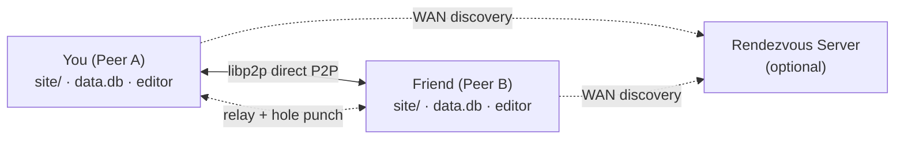
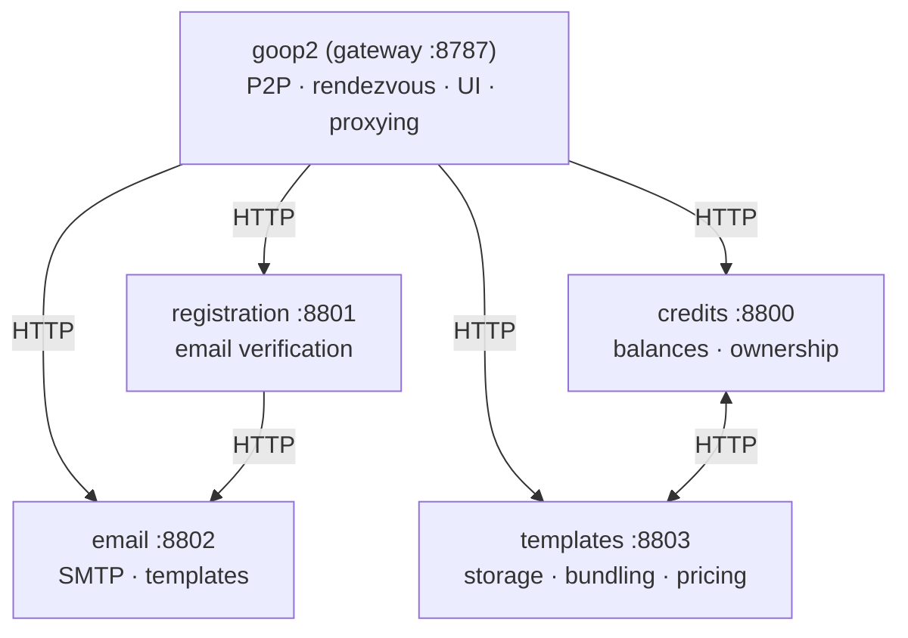

<p align="center">
  
</p>

<h1 align="center">Goop²</h1>
<p align="center"><strong>The web, while it exists.</strong></p>
<p align="center">
  A peer-to-peer platform for ephemeral websites, apps, and services.<br/>
  Your content lives while you're online. When you leave, it disappears.
</p>

<p align="center">
  <a href="#features">Features</a> &middot;
  <a href="#how-it-works">How it works</a> &middot;
  <a href="#quick-start">Quick Start</a> &middot;
  <a href="#templates">Templates</a> &middot;
  <a href="#architecture">Architecture</a>
</p>

---

## What is Goop²?

Goop² lets you run websites, apps, and services that exist only while you're present. No hosting, no deployment, no platform lock-in. Just you and your peers.

Your site is a folder on disk. Start a peer, and it's live. Stop it, and it's gone. Other peers browse your content directly — no server in between.

## Features

- **Peer-to-peer** — sites are served directly between computers using [libp2p](https://libp2p.io/)
- **Ephemeral** — your site appears when you come online and vanishes when you leave
- **LAN + WAN** — peers find each other via mDNS (local network) or rendezvous servers (internet)
- **NAT traversal** — circuit relay v2 + DCUtR hole punching so peers behind routers can connect
- **Built-in editor** — create and edit your site live from the local web UI
- **Templates** — install ready-made interactive apps with one click
- **Lua scripting** — server-side logic for dynamic sites (databases, forms, game logic)
- **Embedded viewer** — browse peer sites in tabbed views without leaving the app
- **Broadcast chat** — message all connected peers in real-time
- **Video/audio calls** — WebRTC calls between peers
- **Desktop app** — native launcher with peer management (built with [Wails](https://wails.io/))

## How it works



Each peer is a self-contained node: a folder with your site files, a SQLite database, a config, and a cryptographic identity. Peers discover each other, exchange presence via [GossipSub](https://docs.libp2p.io/concepts/pubsub/overview/), and serve content directly over libp2p streams.

The rendezvous server is optional — it helps peers find each other across the internet and provides circuit relay for peers behind NAT.

## Quick start

### Desktop app (recommended)

```bash
# requires Go 1.24+ and Wails CLI
wails build
./build/bin/goop2
```

The launcher lets you create peers, start/stop them, and open their editors.

### CLI

```bash
go build -o goop2

# run a peer
./goop2 peer ./peers/mysite

# run a rendezvous server
./goop2 rendezvous ./peers/server
```

### Rendezvous server (production)

```bash
go build -o rendezvous ./cmd/rendezvous
./rendezvous -addr 127.0.0.1:8787
```

Put it behind Caddy or Nginx for HTTPS. See [connecting docs](internal/rendezvous/docs/03-connecting.md) for reverse proxy and systemd configuration.

## Templates

Templates include HTML, CSS, JS, database schemas, and Lua server functions — they're full interactive apps, not just static pages.

### Built-in templates

These ship with goop2 and are available immediately:

| Template | Description |
|---|---|
| **Blog** | Personal blog with posts |
| **Clubhouse** | Community space |
| **Enquete** | Surveys and polls |
| **Tic-Tac-Toe** | PvP multiplayer game between peers |

### Store templates

Additional templates available via the templates service:

| Template | Description |
|---|---|
| **Chess** | Play chess with connected peers |
| **Kanban** | Collaborative task board |
| **Corkboard** | Community bulletin board |
| **Quiz** | Trivia and quiz engine |
| **Photobook** | Photo gallery |
| **Arcade** | Browser games |

You can also build your own templates — any combination of HTML, CSS, JS, and Lua scripts.

## Architecture

Goop² uses a microservice architecture. The gateway handles P2P networking and serves the UI, while optional backend services add registration, credits, email, and template management.



| Service | Port | Purpose |
|---|---|---|
| **goop2** (this repo) | 8787 | Gateway — P2P networking, rendezvous, UI, proxying |
| registrations | 8801 | Email verification, registration database |
| credits | 8800 | Credit balances, template ownership |
| email | 8802 | SMTP sending, HTML email templates |
| templates | 8803 | Template storage, bundling, pricing |

The backend services are currently closed-source but may become open-source in the future. They run on the public rendezvous server at [goop2.com](https://goop2.com) — register there to access the template store and credits system.

Services communicate over HTTP with zero shared imports. Each service can run on a different machine — just configure the URL in the gateway config.

### Key packages (this repo)

| Package | What it does |
|---|---|
| `internal/p2p` | libp2p networking, mDNS, GossipSub, relay, hole punching |
| `internal/rendezvous` | HTTP rendezvous server, SSE events, relay endpoint |
| `internal/content` | Sandboxed filesystem for peer sites |
| `internal/storage` | SQLite database per peer |
| `internal/viewer` | Local web UI (editor, peer browser, settings) |
| `internal/lua` | Lua scripting engine for server-side logic |
| `internal/realtime` | WebRTC video/audio between peers |
| `internal/config` | Configuration and validation |

For the full architecture deep-dive, see the [documentation](#documentation) below.

## Documentation

Detailed documentation lives alongside the code:

- [Overview](internal/rendezvous/docs/01-overview.md) — what Goop² is and how it works
- [Quick Start](internal/rendezvous/docs/02-quickstart.md) — getting up and running
- [Connecting](internal/rendezvous/docs/03-connecting.md) — LAN/WAN, relay, reverse proxy setup
- [Configuration](internal/rendezvous/docs/04-configuration.md) — all config options explained
- [Templates](internal/rendezvous/docs/05-templates.md) — creating and installing templates
- [Scripting](internal/rendezvous/docs/06-scripting.md) — Lua server-side scripting
- [Groups](internal/rendezvous/docs/07-groups.md) — peer groups
- [Advanced](internal/rendezvous/docs/08-advanced.md) — advanced topics
- [FAQ](internal/rendezvous/docs/09-faq.md) — frequently asked questions

## Tech stack

- **Go** — core language
- **[libp2p](https://libp2p.io/)** v0.34.0 — P2P networking (mDNS, GossipSub, circuit relay v2, DCUtR)
- **[Wails](https://wails.io/)** — desktop app framework (Go + WebView)
- **SQLite** — per-peer database
- **Lua** — embedded scripting for dynamic sites
- **WebRTC** — peer-to-peer video/audio calls

## Project structure

```
internal/        # core Go packages
frontend/        # desktop launcher UI (Wails + JS)
cmd/             # standalone binaries (rendezvous server)
peers/           # peer data directories (one folder per peer)
  mysite/
    goop.json    # config
    data.db      # SQLite database
    site/        # your website files
```

## Contributing

Goop² is open source under **GPLv2**. Contributions are welcome.

1. Fork the repo
2. Create a feature branch
3. Submit a pull request

## License

GNU General Public License v2.0 — the same license used by the Linux kernel.
See [COPYING](COPYING) for the full text.

---

<p align="center"><strong>Goop²</strong> — the web, while it exists.</p>
