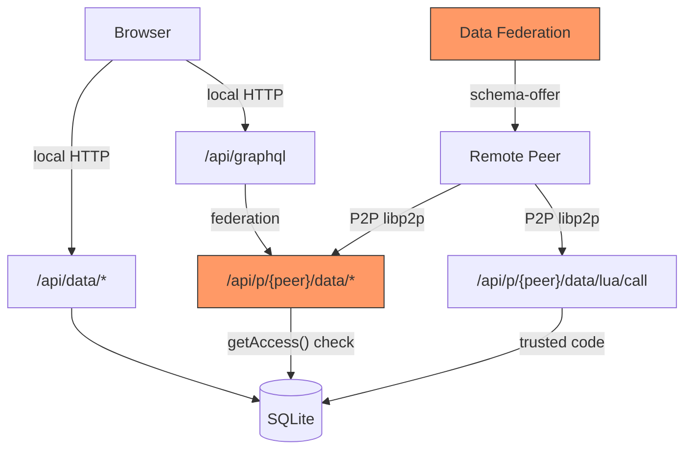

# ORM Table Access Policy

## Problem

Currently goop2 has a single `insert_policy` string per table (`owner`/`email`/`open`/`public`/`group`) stored in `_tables`. This controls who can insert and indirectly affects read scoping. As the project moves toward ORM-only templates, a richer per-operation access policy is needed — especially a `local` mode that prevents any P2P access to a table.

## Design

The new Access policy lives on the ORM schema struct (`schema.Table`). Classic tables keep using `_tables.insert_policy` unchanged. The enforcement layer resolves the right policy regardless of table type — both systems coexist until all templates are converted.

### Access struct

```go
// in internal/orm/schema/schema.go

type Access struct {
    Read   string `json:"read,omitempty"`    // "local", "owner", "group", "open"
    Insert string `json:"insert,omitempty"`  // "local", "owner", "email", "group", "open"
    Update string `json:"update,omitempty"`  // "local", "owner"
    Delete string `json:"delete,omitempty"`  // "local", "owner"
}

type Table struct {
    Name    string   `json:"name"`
    Columns []Column `json:"columns"`
    Context bool     `json:"context,omitempty"`
    Access  *Access  `json:"access,omitempty"` // nil = use insert_policy fallback
}
```

### Policy values

| Value | Meaning |
|-------|---------|
| `local` | Only the local peer's browser. Blocked entirely over P2P. |
| `owner` | Remote peers can only affect their own rows (`_owner = callerID`) |
| `email` | Insert requires email configured; read/update/delete = owner-scoped |
| `group` | Template group co-authors; all rows visible to members |
| `open` | Anyone |

### Backward compatibility mapping

When an ORM schema has `Access == nil`, or for classic (non-ORM) tables, the enforcement layer synthesizes an Access struct from the existing `insert_policy`:

```
AccessFromInsertPolicy(policy) → Access
```

| insert_policy | Read | Insert | Update | Delete |
|---------------|------|--------|--------|--------|
| `owner` | open | owner | owner | owner |
| `email` | owner | email | owner | owner |
| `open` / `public` | open | open | owner | owner |
| `group` | open | group | owner | owner |

No data migration needed. Existing tables continue to work identically.

## Data access surface

All paths that need enforcement, and how `local` blocks them:



| Access path | Enforcement point | `local` behavior |
|-------------|-------------------|------------------|
| `/api/data/*` (local browser) | None needed — always local | Unrestricted |
| `/api/graphql` (local) | None needed — local queries | Unrestricted |
| `/api/p/{peer}/data/query` | `p2p/data.go` `dataOpQuery()` | Rejected |
| `/api/p/{peer}/data/insert` | `p2p/data.go` `dataOpInsert()` | Rejected |
| `/api/p/{peer}/data/update` | `p2p/data.go` `dataOpUpdate()` | Rejected |
| `/api/p/{peer}/data/delete` | `p2p/data.go` `dataOpDelete()` | Rejected |
| GraphQL federation | `datafed/handler.go` `contextTables()` | Not offered to peers |
| Lua `goop.db.*` / `goop.schema.*` | Not enforced (trusted code) | N/A |

### Lua trust model

Lua data functions bypass access checks. This is correct:
- They are deployed code, not arbitrary remote execution
- The user wrote and deployed them on their own peer
- Access policy is enforced at the **network boundary** (`p2p/data.go`), not the storage layer

## Implementation

### Phase 1: Schema types

**File: `internal/orm/schema/schema.go`**

- Add `Access` struct and `Table.Access *Access` field
- `DefaultAccess()` — returns `{Read: "open", Insert: "owner", Update: "owner", Delete: "owner"}`
- `AccessFromInsertPolicy(policy string) Access` — the mapping table above
- `(a *Access) Validate() error` — validates each field against allowed values per operation
- Call `Access.Validate()` from `Table.Validate()` when non-nil
- Unit tests for mapping, validation, JSON round-trip

### Phase 2: Storage resolution

**File: `internal/storage/orm.go`**

- `GetAccess(tableName string) Access` — single resolution point:
  1. ORM schema with `Access != nil` → return it
  2. Fallback → `GetTableInsertPolicy()` → `AccessFromInsertPolicy()`
- `UpdateSchemaAccess(tableName string, access *Access)` — same pattern as `UpdateSchemaContext`

### Phase 3: P2P enforcement (core change)

**File: `internal/p2p/data.go`**

- `(n *Node) getAccess(table string) Access` — delegates to `n.db.GetAccess()`
- Refactor `dataOpQuery` (remote): switch on `access.Read`
  - `local` → reject
  - `owner` → scope to `_owner = callerID`
  - `group` → check membership, no scoping if member
  - `open` → no scoping
- Refactor `dataOpInsert`: switch on `access.Insert` (same cases + `local`)
- Refactor `dataOpUpdate` / `dataOpDelete` (remote): switch on `access.Update` / `access.Delete`
  - `local` → reject
  - `owner` → existing `UpdateRowOwner` / `DeleteRowOwner`
- Local paths unchanged — always unrestricted

### Phase 4: Data federation filter

**File: `internal/group_types/datafed/handler.go`**

- In `contextTables()`: skip tables where `Access.Read == "local"`
- This allows `Context: true` + `Access.Read: "local"` = local GraphQL but not shared with peers
- No filter in `gql/engine.go` — local GraphQL should see local-only tables

### Phase 5: HTTP API

**File: `internal/viewer/routes/schema.go`**

- `POST /api/data/schemas/set-access` — same pattern as `set-context`
- Extend `/api/data/schemas` list response to include `access` field

**File: `internal/ui/assets/js/api.js`**

- Add `schemaApi.setAccess(payload)`

### Phase 6: Schema editor UI

**File: `internal/ui/assets/js/pages/database-schemas.js`**

- Access policy section below the Context toggle
- Four `gsel` dropdowns: Read, Insert, Update, Delete
  - Read: local, owner, group, open
  - Insert: local, owner, email, group, open
  - Update: local, owner
  - Delete: local, owner
- Defaults from `s.access` or `{open, owner, owner, owner}` when nil
- Change handlers call `schemaApi.setAccess()`

### Phase 7: Template application (future path)

**File: `internal/viewer/routes/templates.go`**

- In `applyTemplateFiles()`, after step 5, add step 5b:
  - If bundle contains `schemas/*.json` → load as ORM schemas via `db.CreateTableORM()`
  - Access policy embedded in schema JSON persists automatically
  - Skip `SetTableInsertPolicy()` for tables with ORM Access
- Co-author group creation: scan `Access.Insert` for `"group"` (in addition to current `tablePolicies`)
- Current `schema.sql` + `manifest.json` path remains for unconverted templates

## Key files

| File | Change |
|------|--------|
| `internal/orm/schema/schema.go` | Access struct, defaults, validation, mapping |
| `internal/storage/orm.go` | `GetAccess()`, `UpdateSchemaAccess()` |
| `internal/p2p/data.go` | Core enforcement refactor |
| `internal/group_types/datafed/handler.go` | Filter local-only from federation |
| `internal/viewer/routes/schema.go` | `set-access` HTTP endpoint |
| `internal/ui/assets/js/api.js` | `setAccess` API call |
| `internal/ui/assets/js/pages/database-schemas.js` | Access dropdowns in editor |
| `internal/viewer/routes/templates.go` | ORM schema path in template apply |

## Verification

1. **Unit tests**: Access validation, `AccessFromInsertPolicy` mapping, JSON round-trip
2. **P2P enforcement**: ORM table with `Access.Read="local"` → remote peer rejected
3. **Backward compat**: Classic table with `insert_policy="group"` works identically
4. **Federation**: `Context=true` + `Access.Read="local"` → not offered in `schema-offer`
5. **UI**: Set access policies in schema editor → persist across save/reload
6. **Template apply**: `schema.sql` path (old) still works; `schemas/*.json` path (new) applies Access
7. **Full test suite**: `go test ./...` for both goop2 and goop2-services
