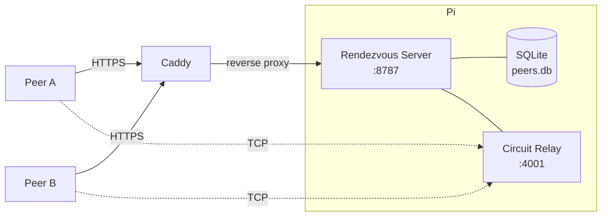
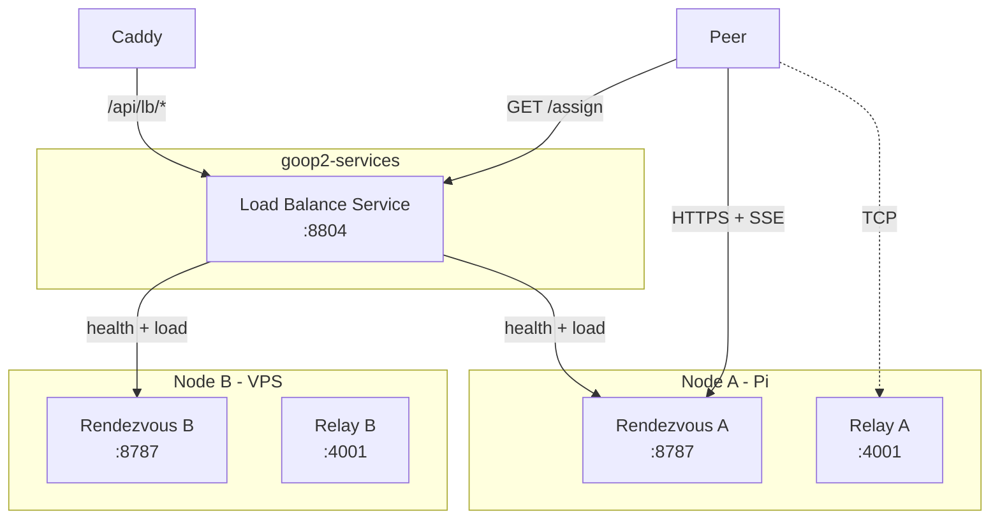
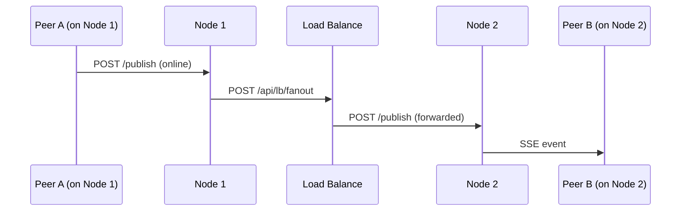

# Rendezvous Clustering

Scale the rendezvous layer horizontally when a single node becomes a bottleneck.

## Current architecture (single node)



**Bottlenecks at scale:**

| Component | Limit | Why |
|---|---|---|
| SSE connections | ~1024 (configurable) | Each peer holds an open connection |
| Relay reservations | 128 (libp2p default) | All relayed traffic flows through one host |
| SQLite writes | Single-writer | Peer upserts serialized |
| Bandwidth | Pi uplink | All relay traffic + SSE fanout |

## Design: load-balance service

A new **`goop2-service-loadbalance`** microservice sits in front of multiple rendezvous nodes. It doesn't replace the rendezvous — it routes peers to the least-loaded one.



### How it works

1. **Peer startup:** peer calls `GET /api/lb/assign` on the load balancer
2. **LB responds** with the URL + relay info of the least-loaded node
3. **Peer connects** to the assigned rendezvous (SSE + publish)
4. **Cross-node fanout:** nodes sync presence via the LB (or direct gossip)

### Assignment response

```json
{
  "rendezvous_url": "https://rv2.goop2.com",
  "relay": {
    "peer_id": "12D3KooW...",
    "addrs": ["/ip4/1.2.3.4/tcp/4001"]
  }
}
```

The peer uses this instead of the hardcoded `rendezvous_wan` config value.

## Cross-node presence sync

Peers on different nodes need to see each other. Two options:

### Option A: LB as fanout hub (simple)



Each rendezvous node forwards publishes to the LB, which fans out to all other nodes. The LB deduplicates by `(peer_id, ts)` to prevent loops.

- **Pro:** Simple, nodes don't need to know about each other
- **Con:** LB is a single point for fanout traffic

### Option B: Direct node gossip (robust)

Nodes maintain a mesh — each node POSTs publishes directly to every other node.

```
Node A --POST /publish--> Node B
Node A --POST /publish--> Node C
Node B --POST /publish--> Node A
...
```

The LB only handles assignment and health. Nodes discover each other via LB's node registry.

- **Pro:** No single fanout bottleneck
- **Con:** O(n²) connections between nodes

**Recommendation:** Start with Option A. With 2–3 nodes the fanout load is trivial. Switch to Option B if the LB fanout becomes a bottleneck (unlikely before 10+ nodes).

## Load balancer service design

### Config (`config.json`)

```json
{
  "listen": ":8804",
  "nodes": [
    {
      "url": "https://goop2.com",
      "relay_port": 4001
    },
    {
      "url": "https://rv2.goop2.com",
      "relay_port": 4001
    }
  ],
  "strategy": "least-connections",
  "health_interval": "10s"
}
```

### API

| Method | Path | Description |
|---|---|---|
| `GET` | `/api/lb/assign` | Returns the best node for a new peer |
| `POST` | `/api/lb/fanout` | Receives a publish from a node, forwards to others |
| `GET` | `/api/lb/nodes` | Lists all nodes with health/load (admin) |
| `GET` | `/healthz` | LB health check |

### Health probing

Every `health_interval`, the LB calls each node's `/healthz` and collects:

```json
{
  "peer_count": 45,
  "sse_clients": 42,
  "relay_reservations": 31,
  "uptime_seconds": 86400
}
```

The rendezvous `/healthz` endpoint needs to be extended to return these metrics.

### Assignment strategies

- **`least-connections`** — assign to node with fewest SSE clients (default)
- **`round-robin`** — simple rotation
- **`geo`** — future: route by IP geolocation to nearest node

## Relay distribution

Each rendezvous node runs its own relay. The LB's `/assign` response includes that node's relay info. Peers only use the relay of their assigned node.

Cross-node P2P connections (Peer A on Node 1 wants to reach Peer B on Node 2) require both peers to have relay addresses. Since both have reservations on their respective relays, libp2p can use either relay as an intermediary — the circuit address published to the rendezvous includes the relay's public address.

## Changes required in goop2

### Client side (`internal/rendezvous/client.go`)

Add `FetchAssignment()`:

```go
func (c *Client) FetchAssignment(ctx context.Context) (*Assignment, error) {
    // GET <lb_url>/api/lb/assign
    // Returns rendezvous URL + relay info
}
```

### Startup (`internal/app/run.go`)

Before connecting to the rendezvous:

```go
if cfg.Presence.LoadBalanceURL != "" {
    assignment, err := lb.FetchAssignment(ctx)
    // Use assignment.RendezvousURL instead of cfg.Presence.RendezvousWAN
    // Use assignment.Relay instead of fetching from /relay
}
```

### Config (`internal/config/config.go`)

```go
type Presence struct {
    // ...existing fields...
    LoadBalanceURL string `json:"load_balance_url"` // empty = direct rendezvous (current behavior)
}
```

### Rendezvous server (`internal/rendezvous/server.go`)

Extend `/healthz` to include load metrics:

```go
type HealthResponse struct {
    OK                int `json:"ok"`
    PeerCount         int `json:"peer_count"`
    SSEClients        int `json:"sse_clients"`
    RelayReservations int `json:"relay_reservations"`
}
```

## Deployment example (2 nodes)

```
goop2.com        → Caddy → rendezvous A (:8787) + relay A (:4001)  [Pi]
rv2.goop2.com    → Caddy → rendezvous B (:8787) + relay B (:4001)  [VPS]
lb.goop2.com     → goop2-service-loadbalance (:8804)                [either machine]
```

Peer config:
```json
{
  "load_balance_url": "https://lb.goop2.com",
  "rendezvous_wan": "https://goop2.com"
}
```

`rendezvous_wan` serves as fallback if the LB is unreachable.

## Migration path

1. Deploy LB service alongside existing Pi rendezvous — zero disruption
2. Add second rendezvous node, register it in LB config
3. Update peer configs to use `load_balance_url`
4. Old peers without LB config continue using `rendezvous_wan` directly — still works

## Capacity estimate

| Nodes | Peers (SSE) | Relay slots | Notes |
|---|---|---|---|
| 1 (current) | ~1000 | 128 | Pi limited by uplink |
| 2 | ~2000 | 256 | Pi + cheap VPS |
| 3 | ~3000 | 384 | Diminishing returns on fanout cost |

Beyond 3–4 nodes, Option B (direct gossip) or a proper message bus (NATS, Redis pub/sub) would be more efficient for cross-node sync.
