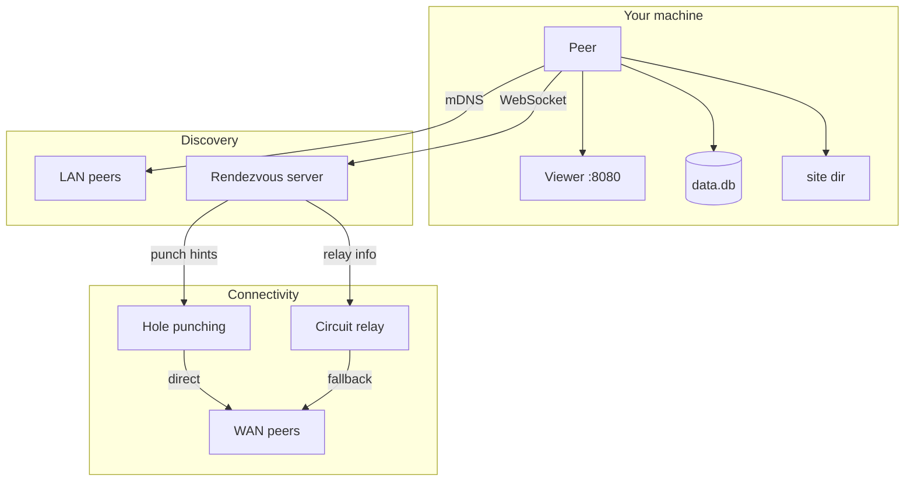

# What is Goop2?

Goop2 is a peer-to-peer platform for the **ephemeral web**. Instead of uploading your site to a centralized host, you run a Goop2 peer on your own machine. Your websites, apps, and services exist while you are online and vanish when you shut down -- no servers, no monthly bills, no platform lock-in.

## Core ideas

- **Ephemeral by design** -- Content exists only while its owner is present and online. There is no permanent hosting.
- **Peer-first architecture** -- Every participant is both client and server. You serve your own content and browse other peers directly.
- **No central control** -- Discovery happens via local-network mDNS or lightweight rendezvous servers. Nobody owns the network.
- **Direct connections** -- Peers exchange data over libp2p streams. When direct connections aren't possible, a circuit relay helps peers connect through NAT.
- **Real-time collaboration** -- Groups, video calls, file sharing, and cluster compute all work peer-to-peer with no central server in the data path.

## How it works

Each peer is a folder on disk containing a configuration file, a site directory, and a local database. When you start a peer, Goop2:

1. Generates (or loads) a cryptographic identity.
2. Announces presence on the local network via mDNS and, optionally, to a rendezvous server for WAN discovery.
3. Serves your `site/` directory to any peer that requests it.
4. Opens a local viewer in your browser so you can manage your site and visit others.

Visitors see your site rendered in their own viewer. Data operations (forms, comments, game moves) flow over peer-to-peer streams and are stored in the site owner's local database.

## Key concepts

| Concept | Description |
|---------|-------------|
| **Peer** | One folder + one config + one cryptographic identity. |
| **Site** | Static files in the `site/` directory, served to visitors. |
| **Database** | A local SQLite database (`data.db`) for dynamic content. |
| **Presence** | Soft state: peers announce periodically; absence is inferred after a timeout. |
| **Template** | A pre-built application (blog, quiz, game) that bundles HTML, CSS, JS, a database schema, and optional Lua logic. |
| **Group** | A real-time communication channel between peers -- used for chat, games, file sharing, and cluster compute. |
| **Rendezvous** | A lightweight server that helps peers on different networks find each other. It handles discovery only -- not data. |
| **Relay** | A circuit relay (libp2p relay v2) that helps peers behind NAT connect when direct hole-punching fails. Runs alongside the rendezvous server. |
| **MQ** | A unified message queue that carries all real-time events (group messages, call signaling, peer announcements) over a single event stream. |
| **Video calls** | Peer-to-peer video and audio calls using Pion WebRTC, with WebM streaming for platforms without browser WebRTC support. |
| **Cluster** | Distributed compute across peers -- a host dispatches jobs to workers running executor binaries. |
| **File sharing** | Upload and share files within a group. Members can browse and download files from any peer in the group. |
| **Bridge** | A thin-client mode where peers connect through a WebSocket bridge instead of running a full libp2p node. |
| **Encryption** | NaCl key exchange between peers and broadcast key distribution managed by an optional encryption service. |

## What Goop2 is not

- It is not a blockchain or cryptocurrency project.
- It is not a CDN or static-site host.
- It is not designed for always-on, high-availability services.

Goop2 is best suited for personal sites, small communities, creative experiments, and any context where presence and ephemerality matter more than permanence.
