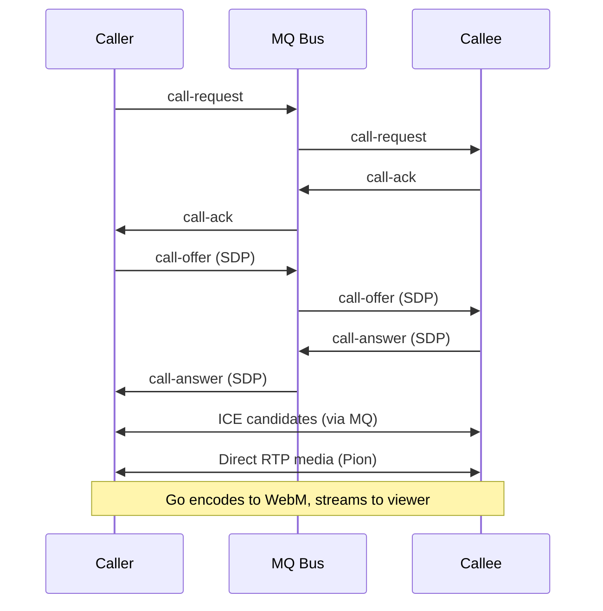
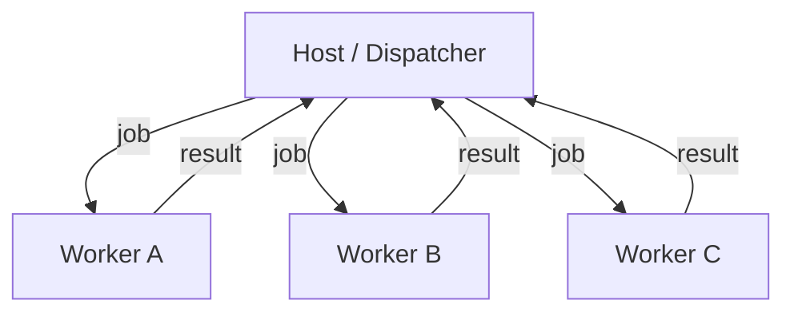

# Advanced Topics

## Running behind a reverse proxy

A rendezvous server is typically placed behind a reverse proxy like Caddy or Nginx to provide HTTPS and a custom domain. Set `external_url` so peers see the correct public address:

```json
{
  "presence": {
    "external_url": "https://goop2.com",
    "rendezvous_port": 8787,
    "rendezvous_bind": "0.0.0.0"
  }
}
```

The reverse proxy should forward traffic to the rendezvous port (default `8787`). Example Caddy configuration:

```
goop2.com {
    reverse_proxy localhost:8787
}
```

## Port forwarding and direct connections

By default, libp2p picks a random port for peer-to-peer connections. If you're behind a router and want reliable direct connections (avoiding relay), forward a fixed port:

```json
{
  "p2p": { "listen_port": 4001 }
}
```

Then forward port `4001` (TCP) on your router to your machine. This allows other peers to connect directly without needing the circuit relay.

## Circuit relay tuning

The relay runs alongside the rendezvous server and helps peers behind NAT reach each other. It only forwards encrypted traffic and cannot read the content.

```json
{
  "presence": {
    "relay_port": 4001,
    "relay_key_file": "data/relay.key",
    "relay_cleanup_delay_sec": 3,
    "relay_poll_deadline_sec": 10,
    "relay_connect_timeout_sec": 5,
    "relay_refresh_interval_sec": 90,
    "relay_recovery_grace_sec": 5
  }
}
```

Peers discover the relay automatically via the rendezvous server's `/relay` endpoint. When a direct connection fails, libp2p falls back to the relay and then attempts hole-punching (DCUtR) to upgrade to a direct connection.

## Video calls

Goop2 supports peer-to-peer video and audio calls using Pion WebRTC. The call stack runs natively in Go -- no browser WebRTC dependency is needed. Native calls are currently available on **Linux only** and are enabled automatically (no configuration needed).

Video is encoded as WebM (VP8 + Opus) and streamed to the viewer via HTTP chunked streaming. GStreamer's `souphttpsrc` handles playback natively in WebKitGTK.

### How it works



1. Caller initiates a call via the MQ bus (`call:{channelID}` topic).
2. Callee accepts, and SDP offer/answer exchange happens over MQ.
3. ICE candidates are exchanged for NAT traversal.
4. Once connected, RTP media flows directly between peers via Pion.
5. Go encodes the media to WebM and streams it to the local viewer.

### Camera and microphone preferences

Set preferred devices in your config:

```json
{
  "viewer": {
    "preferred_cam": "Logitech C920",
    "preferred_mic": "Blue Yeti"
  }
}
```

To disable video calls entirely:

```json
{
  "viewer": {
    "video_disabled": true
  }
}
```

## Cluster compute

The cluster system distributes computation across multiple peers. One peer creates a cluster (host/dispatcher) and other peers join as workers.

### Architecture

The host maintains a job queue and dispatches work to connected workers. Workers execute jobs using a configurable executor binary that communicates over stdin/stdout with newline-delimited JSON.



### Worker setup

```json
{
  "viewer": {
    "cluster_binary_path": "/usr/local/bin/my-executor",
    "cluster_binary_mode": "daemon"
  }
}
```

- **oneshot**: Binary is started per job and exits after producing a result.
- **daemon**: Binary starts once and handles multiple jobs via stdin/stdout.

See the [Executor Protocol](executor) page for the full binary contract, lifecycle, and code examples in multiple languages.

## Bridge mode

Bridge mode is an alternative to running a full libp2p P2P node. A thin-client peer connects through a bridge service over WebSocket and appears as a virtual peer on the network.

```json
{
  "p2p": { "bridge_mode": true },
  "presence": { "bridge_url": "http://localhost:8804" },
  "profile": { "email": "me@example.com" }
}
```

The bridge service runs alongside the rendezvous server. It handles authentication, peer registration, and message relay. Bridge peers can do everything a full P2P peer can -- browse sites, join groups, send messages -- but all traffic is relayed through the bridge instead of flowing directly.

## Encryption

When an encryption service is configured, Goop2 enables peer-to-peer encryption:

- **Key exchange**: Peers upload their NaCl public keys to the encryption service. Other peers can fetch them to encrypt direct messages.
- **Broadcast keys**: The encryption service distributes sealed broadcast keys for group communications. Keys are rotated periodically.

NaCl keypairs are generated automatically on first use and stored in the peer's config (`nacl_public_key` / `nacl_private_key`).

## Running multiple peers

You can run multiple peers on the same machine by giving each a separate directory and viewer port:

```bash
goop2 peer peers/alice
goop2 peer peers/bob
```

Each peer gets its own `goop.json`, identity key, database, and site directory. Set different `viewer.http_addr` ports to avoid conflicts. In the desktop app, you can create and manage multiple peers through the GUI.

## Backup and migration

All peer state lives in a single directory:

| Path | Contains |
|------|----------|
| `goop.json` | Configuration |
| `data/identity.key` | Persistent peer identity (your Peer ID) |
| `data/relay.key` | Relay identity (rendezvous only) |
| `data/peers.db` | Registration and peer database (rendezvous only) |
| `site/` | Your site files and database |

To back up or migrate a peer, copy the entire directory. The `identity.key` is what determines your Peer ID -- if you lose it, you get a new identity.

## Exposing your site to the regular web

The Goop2 viewer already serves your site over plain HTTP at paths like:

```
http://127.0.0.1:8080/p/<peer-id>/
```

This works in any regular browser -- visitors don't need Goop2 installed. That means **anyone with a laptop can run a fully interactive website** and share it with the world. A chess game, a quiz for your class, a kanban board for your team, a community corkboard -- just pick a template, start your peer, and share the link.

By default the viewer binds to `127.0.0.1`, which limits access to your own machine. To open it up:

**1. Bind to all interfaces:**

```json
{
  "viewer": {
    "http_addr": "0.0.0.0:8080"
  }
}
```

**2. Optionally, put a reverse proxy in front for HTTPS and a custom domain:**

```
mysite.example.com {
    reverse_proxy localhost:8080
}
```

Visitors can then reach your site at `https://mysite.example.com/p/<peer-id>/` using any browser. Add a redirect rule in your reverse proxy to map `/` to `/p/<your-peer-id>/` for a cleaner URL.

**Why this is powerful:**

- **Zero deployment** -- no hosting provider, no containers, no CI/CD. Just run your peer.
- **Zero cost** -- your laptop is the server. As long as it's on, your site is live. Goop2 runs just fine on a Raspberry Pi too.
- **Fully interactive** -- forms, real-time games, comments, leaderboards, video calls all work. Data operations are proxied through the viewer to your local database.
- **Ephemeral by nature** -- close your laptop and the site vanishes. No data left behind on someone else's server.

This makes Goop2 ideal for **temporary or community-driven sites**: a teacher running a quiz during class, a club sharing a pinboard for an event, a game night with friends, or a small team collaborating on a kanban board.

**Things to keep in mind:**

- Your site is only reachable while your peer is running.
- Your upload speed and hardware determine how many visitors you can handle.
- If you're behind a router, you may need to forward the viewer port or use the circuit relay for connectivity.
- For visiting **other** peers' sites through your viewer, your peer must be connected to them (via LAN or rendezvous). The viewer acts as a bridge between HTTP and the P2P network.
