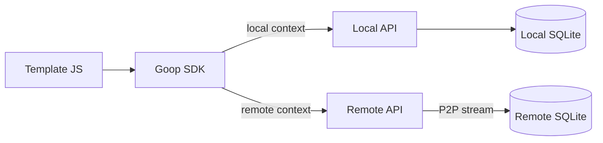

# JavaScript SDK

The Goop2 SDK is a set of JavaScript modules that templates load to interact with the peer. Each module is a single `<script>` tag served from `/sdk/` and attaches to the global `Goop` object.

## Loading

```html
<script src="/sdk/goop-data.js"></script>
<script src="/sdk/goop-identity.js"></script>
<script src="/sdk/goop-ui.js"></script>
<script src="app.js"></script>
```

Load only the modules you need. The SDK auto-detects whether the template is running on the local peer (`/`) or viewing a remote peer (`/p/<peerID>/`), and routes API calls to the correct peer transparently.



## Modules

| Module | Global | Purpose |
|--------|--------|---------|
| `goop-data.js` | `Goop.data` | Database CRUD, schema, Lua function calls |
| `goop-identity.js` | `Goop.identity` | Peer ID, display name, email |
| `goop-peers.js` | `Goop.peers` | Peer discovery and status polling |
| `goop-group.js` | `Goop.group` | Group membership, messaging |
| `goop-chat.js` | `Goop.chat` | Direct and broadcast chat over MQ |
| `goop-realtime.js` | `Goop.realtime` | Virtual MQ-based channels |
| `goop-call.js` | `Goop.call` | Audio/video calling |
| `goop-api.js` | `Goop.api` | Virtual REST API over Lua data functions |
| `goop-site.js` | `Goop.site` | File storage (read, upload, delete) |
| `goop-ui.js` | `Goop.ui` | Toast, confirm, prompt dialogs |
| `goop-form.js` | `Goop.form` | JSON-driven form renderer |
| `goop-forms.js` | `Goop.forms` | Auto-generated CRUD UI from schema |
| `goop-drag.js` | `Goop.drag` | Drag-and-drop with sortable lists |
| `goop-engine.js` | `GameLoop, Renderer, ...` | 2D game engine (Canvas) |

## Goop.data

Database access. Works in both self and remote peer context.

```javascript
const db = Goop.data;

// List tables (includes mode: orm/classic)
const tables = await db.tables();

// Describe a table's columns
const info = await db.describe("tasks");

// Create table (ORM format with typed columns)
await db.createTable("tasks", [
  {name: "id",    type: "integer", key: true},
  {name: "title", type: "text",    required: true},
  {name: "score", type: "real"}
]);

// Insert
const {id} = await db.insert("tasks", {title: "Hello", score: 9.5});

// Query with options
const rows = await db.query("tasks", {limit: 10, where: "score > ?", args: [5]});

// Update by _id
await db.update("tasks", id, {score: 10});

// Delete by _id
await db.remove("tasks", id);

// Drop a table
await db.dropTable("tasks");

// Add a column
await db.addColumn("tasks", {name: "priority", type: "INTEGER", not_null: false});

// Call a Lua data function
const result = await db.call("score-quiz", {answers: [1, 2, 3]});

// List available Lua functions
const fns = await db.functions();
```

## Goop.api

Virtual REST-like API backed by a server-side Lua function. Requires `goop-data.js`. Templates define endpoints in `api.json`; without it, all tables get default CRUD.

```javascript
const api = Goop.api;

// Get a single record by slug or id
const post = await api.get("posts", {slug: "hello-world"});
// → {found: true, item: {_id, title, body, ...}}

// List records (paginated)
const result = await api.list("posts", {limit: 10, offset: 0});
// → {items: [...]}

// Insert, update, delete
await api.insert("posts", {title: "New", body: "Content"});
await api.update("posts", 42, {title: "Updated"});
await api.delete("posts", 42);

// Config table as key-value map
const config = await api.map("config");
// → {theme: "dark", accent: "#2d6a9f"}
```

### api.json

Endpoint declarations placed in the site root:

```json
{
  "posts": {
    "table": "posts",
    "slug": "slug",
    "filter": "published = 1",
    "fields": ["title", "body", "author_name"],
    "get": true,
    "list": {"order": "_id DESC", "limit": 50},
    "insert": true, "update": true, "delete": true
  },
  "config": {
    "table": "blog_config",
    "map": {"key": "key", "value": "value"}
  }
}
```

Without `api.json`, all tables are exposed with default CRUD (get by `_id`, list by `_id DESC`, limit 50). See the Lua scripting page for the server-side architecture.

## Goop.identity

```javascript
const info  = await Goop.identity.get();    // {id, label, email}
const myId  = await Goop.identity.id();     // peer ID string
const name  = await Goop.identity.label();  // display name
const email = await Goop.identity.email();  // email string
Goop.identity.refresh();                    // clear cache, force re-fetch
```

## Goop.peers

```javascript
// One-time fetch
const peers = await Goop.peers.list();
// Each peer: {ID, Content, Email, AvatarHash, VideoDisabled,
//   ActiveTemplate, Verified, Reachable, Offline, LastSeen}

// Live updates (polls every 5s by default)
Goop.peers.subscribe({
  onSnapshot(peers) { /* full list on first load */ },
  onUpdate(peerId, peer) { /* peer came online or changed */ },
  onRemove(peerId) { /* peer pruned from list */ },
  onError() { /* optional error handler */ }
}, 5000);

// Stop polling
Goop.peers.unsubscribe();
```

## Goop.group

```javascript
// Create a hosted group
await Goop.group.create("My Room", "realtime", 10);

// List hosted groups
const groups = await Goop.group.list();

// Join a remote group
await Goop.group.join(hostPeerId, groupId);

// Send a message to the group
await Goop.group.send({action: "move", x: 5}, groupId);

// Leave a group
await Goop.group.leave();

// Host joins/leaves own group
await Goop.group.joinOwn(groupId);
await Goop.group.leaveOwn(groupId);

// Close a hosted group
await Goop.group.close(groupId);

// SSE event stream
const es = Goop.group.subscribe(function(evt) {
  // evt.type: "welcome", "members", "msg", "state", "leave", "close", "invite"
});
Goop.group.unsubscribe();
```

## Goop.chat

```javascript
// Direct message
await Goop.chat.send(peerId, "Hello!");

// Broadcast to all peers
await Goop.chat.broadcast("Server restarting");

// Subscribe to incoming messages via MQ
Goop.chat.subscribe(function(msg) {
  // msg: {from, content, type, timestamp}
  // type: "broadcast" or "direct"
});
Goop.chat.unsubscribe();
```

## Goop.realtime

Virtual MQ-based channels for real-time peer communication.

```javascript
// Connect to a peer
const ch = await Goop.realtime.connect(peerId);

// Channel methods
ch.send({action: "ping"});
ch.onMessage(function(msg, env) { /* env: {channel, from} */ });
ch.close();

// Accept an incoming channel
const ch = await Goop.realtime.accept(channelId, hostPeerId);

// Listen for incoming channel invitations
Goop.realtime.onIncoming(function(info) {
  // info: {channelId, hostPeerId}
});
```

## Goop.call

Audio/video calling.

```javascript
// Start a call
const session = await Goop.call.start(peerId, {video: true, audio: true});

session.onRemoteStream(function(stream) { video.srcObject = stream; });
session.onHangup(function() { /* call ended */ });
session.hangup();
session.toggleAudio();
session.toggleVideo();

// Listen for incoming calls
Goop.call.onIncoming(function(info) {
  const session = await info.accept({video: true, audio: true});
  // or: info.reject();
});
```

## Goop.site

File storage for the peer's site content directory.

```javascript
const files = await Goop.site.files();
const content = await Goop.site.read("data.json");
const response = await Goop.site.fetch("image.png");
await Goop.site.upload("data.json", fileOrBlob);
await Goop.site.remove("data.json");
```

## Goop.ui

Portable UI helpers. Auto-injects minimal CSS.

```javascript
Goop.ui.toast("Saved!");
Goop.ui.toast({title: "Error", message: "Something failed", duration: 6000});

const ok = await Goop.ui.confirm("Delete this item?", "Confirm");
const name = await Goop.ui.prompt("Enter your name:", "Default", "Title");
const theme = Goop.ui.theme();  // "dark" or "light"
```

## Goop.form

JSON-driven form renderer. Requires `goop-data.js` and `goop-identity.js`.

```javascript
await Goop.form.render(document.getElementById("form"), {
  table: "responses",
  fields: [
    {name: "name",    label: "Your Name", type: "text",     required: true},
    {name: "rating",  label: "Rating",    type: "number"},
    {name: "comment", label: "Comment",   type: "textarea"},
    {name: "color",   label: "Color",     type: "select",   options: ["Red", "Blue", "Green"]},
    {name: "agree",   label: "I agree",   type: "checkbox"}
  ],
  submitLabel: "Send",
  singleResponse: true,
  onDone: function() { /* callback after save */ }
});
```

## Goop.forms

Auto-generated CRUD UI from table schemas. Requires `goop-data.js` and `goop-ui.js`.

```javascript
// Full CRUD interface
await Goop.forms.render(document.getElementById("crud"), "tasks");

// Insert form only
await Goop.forms.insertForm(document.getElementById("form"), "tasks", function() {
  // called after row inserted
});
```

## Goop.drag

Reusable drag-and-drop with sortable lists.

```javascript
const instance = Goop.drag.sortable(container, {
  items: "> .card",
  handle: ".drag-handle",
  group: "kanban",
  direction: "vertical",
  onEnd(evt) { /* {item, from, to, oldIndex, newIndex} */ }
});
instance.destroy();
```

## Goop Engine

2D game engine for Canvas-based templates. Exposes global classes (not under `Goop`).

```javascript
const loop = new GameLoop(60);
loop.start(update, render);

const renderer = new Renderer(canvas);
renderer.clear("#000");
renderer.drawRect(x, y, w, h, color);
renderer.drawSprite(image, sx, sy, sw, sh, dx, dy, dw, dh);
renderer.drawText(text, x, y, font, color, align);

const sheet = new SpriteSheet("sprites.png", 16, 16);
const input = new Input();
input.bind(canvas);

const scenes = new SceneManager();
scenes.add("menu", { enter(){}, update(dt){}, render(r){}, exit(){} });
scenes.switch("menu");
```
