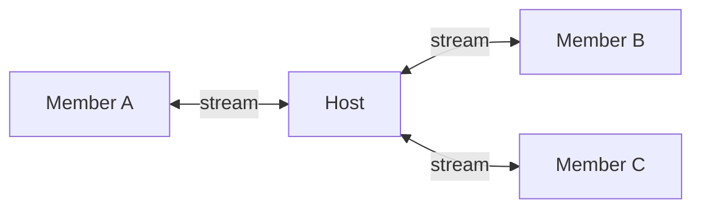

# Groups & Collaboration

Groups are real-time, multi-peer communication channels. They enable features like multiplayer games, live quizzes, collaborative editing, group chat, file sharing, and distributed compute.

## How groups work

Groups use a **host-relayed model**. The peer that creates a group acts as the hub. Every member opens a long-lived bidirectional stream to the host, and the host relays messages between members.



This model works naturally because the host already serves the site, stores data, and knows its visitors. All group events flow through the unified MQ bus.

## Group types

Every group has a `group_type` that determines its behavior. Each type is backed by a `TypeHandler` that manages lifecycle hooks (create, join, leave, close, event). The registered types are:

| Type | Package | Use case | Volatile |
|------|---------|----------|----------|
| `template` | `group_types/template` | Groups owned by the active template (co-author access). Cleaned up on template switch. | No |
| `chat` | `group_types/chat` | Bounded group chat rooms with message history. MQ topic: `chat.room:{groupID}:*`. Cleaned up by context on template switch. | No |
| `files` | `group_types/files` | Shared file storage between group members. Each peer owns their files. | No |
| `listen` | `group_types/listen` | Live audio streaming sessions. Host streams, members listen. | No |
| `cluster` | `group_types/cluster` | Distributed compute. Host dispatches jobs, workers execute. | Yes |
| `data-federation` | `group_types/datafed` | GraphQL schema federation across peers. | No |

Groups also carry a `group_context` that identifies the owner or purpose (e.g. template name, cluster job name).

Groups without a registered handler (e.g. `general`, `message`) still work — they just have no lifecycle hooks.

## Creating a group

Groups are created through the **Groups** page, programmatically via the HTTP API, or from Lua via `goop.group.create()`. The group is stored in the host's SQLite database.

### HTTP API

| Endpoint | Description |
|----------|-------------|
| `POST /api/groups` | Create a group (`name`, `group_type`, `group_context`, `max_members`, `volatile`) |
| `GET /api/groups` | List all hosted groups with members, roles, and settings |
| `POST /api/groups/close` | Close a group and disconnect all members |
| `POST /api/groups/join-own` | Host joins their own group as a member |
| `POST /api/groups/leave-own` | Host leaves their own group |
| `POST /api/groups/invite` | Invite a peer to a group (`group_id`, `peer_id`) |
| `POST /api/groups/kick` | Remove a member from a group |
| `POST /api/groups/join` | Join a remote group (`host_peer_id`, `group_id`) |
| `POST /api/groups/leave` | Leave a remote group |
| `POST /api/groups/rejoin` | Reconnect to a previously joined group |
| `POST /api/groups/send` | Send a message to a group |
| `POST /api/groups/meta` | Update group name and max members |
| `POST /api/groups/max-members` | Update max member limit |
| `POST /api/groups/set-role` | Change a member's role (`group_id`, `peer_id`, `role`) |
| `POST /api/groups/set-default-role` | Set the default role for new joiners |
| `POST /api/groups/set-roles` | Set the available roles list for a group |
| `GET /api/groups/subscriptions` | List remote groups you've joined |
| `POST /api/groups/subscriptions/remove` | Remove a subscription |

## Joining a group

Members join by sending a join message to the host over the MQ bus. The join flow is:

1. Member sends a `join` message via MQ to the host (`group:{groupID}:join`).
2. Host validates and adds the member.
3. Host sends a `welcome` message with the current member list and state.
4. Host broadcasts an updated `members` list to all other members.

## Message types

| Type | Direction | Purpose |
|------|-----------|---------|
| `join` | Member to Host | Request to join a group |
| `welcome` | Host to Member | Confirmation with current state |
| `members` | Host to Members | Updated member list |
| `msg` | Both directions | Application message (chat, game move) |
| `meta` | Host to Members | Group metadata update |
| `ping` / `pong` | Both directions | Keep-alive |
| `leave` | Member to Host | Member leaving |
| `close` | Host to Members | Group is being closed |

All group events are published on the MQ bus under the topic `group:{groupID}:{type}`. Group invites use `group.invite`.

## File sharing

File groups let peers share documents within a group. Any member can upload files and browse or download files shared by other members.

### Creating a file group

Create a group with type `files` from the **Groups** page.

### Uploading files

Upload files through the viewer's file sharing UI or via the API:

- `POST /api/docs/upload` -- Multipart upload (max 50 MB per file)
- `POST /api/docs/upload-local` -- Upload from a local filesystem path

### Browsing and downloading

- `GET /api/docs/browse` -- Aggregates file lists from all group members (parallel query, 8s timeout per peer)
- `GET /api/docs/download` -- Download a file from any member (local or proxied from remote peer)
- `GET /api/docs/my` -- List your own shared files in a group

Files are stored on each member's disk. When you browse, the viewer queries all online members and merges their file lists. Downloads are streamed directly from the owning peer.

## Cluster compute

Cluster groups enable distributed computation across peers. One peer acts as the **host** (dispatcher) and others join as **workers**. The host dispatches jobs to workers, which execute them using a configured executor binary.

### Roles

| Role | Responsibility |
|------|---------------|
| **Host** | Creates the cluster, dispatches jobs, collects results |
| **Worker** | Joins a cluster, executes jobs using an executor binary |

### Setting up a worker

Configure the executor binary in your `goop.json`:

```json
{
  "viewer": {
    "cluster_binary_path": "/path/to/my-executor",
    "cluster_binary_mode": "daemon"
  }
}
```

Binary modes:
- **oneshot** -- Started per job, exits after producing a result.
- **daemon** -- Started once, handles multiple jobs via stdin/stdout JSON.

See the [Executor Protocol](executor) page for the full binary contract and code examples.

### Submitting jobs

The host submits jobs via the API or UI. Jobs have a type, payload, optional priority, timeout, and retry policy. The dispatcher assigns jobs to available workers and streams output back to the host.

## Template groups

When a template's schemas use `group` access policies or define a roles map, Goop2 automatically creates a template group on apply. Lua scripts can create additional groups of any registered type via `goop.group.create()`. Groups with `group_type = "template"` and `group_context` matching the template name are cleaned up when the template is switched. Members join via the Groups page. The owner always has full access.

### Role-based data access

Each schema can define custom roles with per-operation permissions:

```json
{
  "name": "posts",
  "access": { "read": "open", "insert": "group", "update": "group", "delete": "owner" },
  "roles": {
    "coauthor": { "read": true, "insert": true, "update": true, "delete": true },
    "viewer": { "read": true }
  }
}
```

When a remote peer performs a data operation on a `group`-policy table, the P2P data layer looks up the peer's role in the template group and checks it against the schema's roles map. Unknown roles are denied.

### Default role

The manifest `default_role` field controls what role new members receive when they join. Without it, members join as `"viewer"`. The blog template sets `"default_role": "coauthor"` so invited members can post immediately.

### Group roles

Each group has a configurable list of available roles and a default role for new members. These are managed via the HTTP API (see above), the Schema editor's **Roles** tab, or via Lua:

```lua
goop.group.set_role(group_id, peer_id, "coauthor")
```

A peer can ask the host for its role and permissions on any schema:

```javascript
var r = await Goop.data.role("posts");
// r.role = "coauthor", r.permissions = {read: true, insert: true, ...}
```

This goes through the P2P data protocol — the host is the authority.

### Group lifecycle

- **Apply template** -- group created if any schema needs it, owner auto-joins
- **Re-apply same template** -- existing group and members preserved
- **Switch to different template** -- all groups owned by the old template are closed, new ones created if needed
- **No group schemas** -- no group created

All template groups are identified by `group_context` matching the template name. Groups are never auto-deleted on startup — only the template apply flow manages their lifecycle.

## JavaScript API

Templates interact with groups through the `Goop.group` API:

```javascript
// List available groups
const groups = await Goop.data.query("_groups");

// Join a group
Goop.group.join("chess-42", function(msg) {
    console.log("Received:", msg);
});

// Send a message
Goop.group.send({ move: "e2e4" });

// Leave the group
Goop.group.leave();
```

## Use cases

### Multiplayer game

1. Host creates an ephemeral group for a chess match.
2. Opponent joins via the game UI.
3. Moves are exchanged in real time through the group channel.
4. Move history is stored in the host's database.
5. When the game ends, the group dissolves but the history persists.

### File sharing workspace

1. Host creates a file group for a project.
2. Team members join and upload documents.
3. Everyone can browse and download files from any member.
4. Files live on each member's machine -- no central storage.

### Distributed processing

1. Host creates a cluster and submits computation jobs.
2. Workers join and execute jobs using their local executor binary.
3. Results stream back to the host in real time.
4. Workers can join and leave dynamically; the dispatcher handles reassignment.

## Interaction with other protocols

| Task | Protocol |
|------|----------|
| Serve the UI | `/goop/site/1.0.0` |
| Store persistent data | `/goop/data/1.0.0` |
| Real-time messaging | MQ bus (`/goop/mq/1.0.0`) |
| Discover groups | Query `_groups` via `/goop/data/1.0.0` |
| Event delivery | MQ topics (`group:{groupID}:{type}`) |
