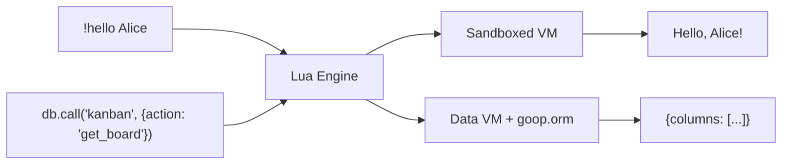
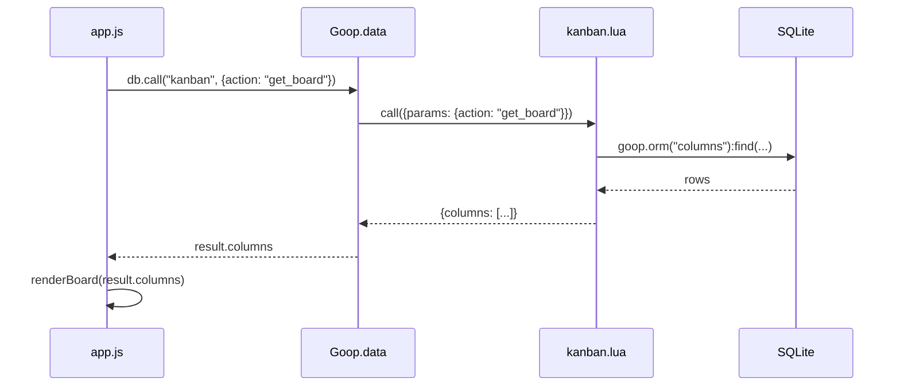
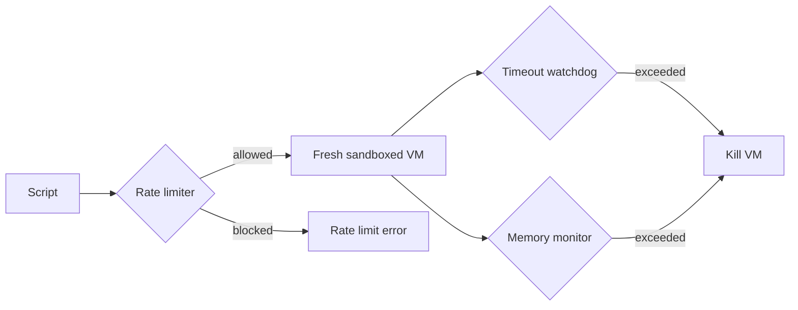

# Scripting with Lua

Goop2 includes an embedded Lua runtime for server-side logic. Lua scripts power template backends, chat commands, data validation, game rules, and more.

## Enabling Lua

Add the `lua` section to your `goop.json`:

```json
{
  "lua": {
    "enabled": true,
    "script_dir": "site/lua",
    "timeout_seconds": 5,
    "max_memory_mb": 10
  }
}
```

Templates enable Lua automatically when they include scripts in `lua/functions/`.

## Script types



### Chat commands

Files in `site/lua/` (not in `functions/`) are chat commands. A visitor sends a message starting with `!` and the matching script runs.

File: `site/lua/hello.lua`

```lua
function handle(args)
    return "Hello, " .. (args ~= "" and args or "world") .. "!"
end
```

A visitor typing `!hello Alice` receives `Hello, Alice!`.

### Data functions

Files in `site/lua/functions/` are data functions — the template backend. They are called from the browser via `Goop.data.call()` and return structured data.

File: `site/lua/functions/myapp.lua`

```lua
function call(request)
    local params = request.params
    return { message = "Hello", action = params.action }
end
```

Called from JavaScript:

```javascript
var result = await Goop.data.call("myapp", { action: "greet" });
// result = { message: "Hello", action: "greet" }
```

## How frontend and backend connect

When JS calls `db.call("kanban", { action: "get_board" })`, the SDK sends the request to the Lua engine. The engine creates a fresh sandboxed VM, loads `lua/functions/kanban.lua`, and calls its `call()` function with a request table:

```lua
function call(request)
    -- request.params = the JS object you passed
    -- request.params.action = "get_board"
    -- request.params.card_id = 42  (if you passed it)
    local action = request.params.action
    local card_id = request.params.card_id
end
```

The Lua function returns a table, which becomes the JSON response in JS:



### Who is calling?

Every Lua invocation knows who's calling:

```lua
goop.peer.id       -- the viewer's peer ID (who triggered this call)
goop.peer.label    -- the viewer's display name

goop.self.id       -- the site owner's peer ID (whose site this is)
goop.self.label    -- the site owner's display name
```

Check if the caller is the site owner:

```lua
if goop.peer.id ~= goop.self.id then
    return { error = "only the site owner can do this" }
end
```

Or use the `goop.owner()` wrapper (see below).

## Patterns

### Action dispatcher with goop.route

Most templates use a single Lua function with `goop.route()` to handle multiple actions. The router extracts `action` from `request.params` and calls the matching handler with `params`:

```lua
local function get_items(params)
    return { items = items_tbl:find({ order = "_id DESC" }) or {} }
end

local function add_item(params)
    if not params.title or params.title == "" then
        return { error = "title required" }
    end
    local id = items_tbl:insert({ title = params.title })
    return { id = id }
end

local dispatch = goop.route({
    get_items = get_items,
    add_item  = add_item,
})

function call(req) return dispatch(req) end
```

JS calls different actions on the same function:

```javascript
var result = await db.call("myapp", { action: "get_items" });
await db.call("myapp", { action: "add_item", title: "New task" });
```

Or using the `api()` shorthand (inserts `action` automatically):

```javascript
var api = Goop.data.api("myapp");
var result = await api("get_items");
await api("add_item", { title: "New task" });
```

### Owner-only actions with goop.owner

Wrap handlers with `goop.owner()` to restrict them to the site owner. If a non-owner calls it, an error is raised automatically:

```lua
local dispatch = goop.route({
    get_board     = get_board,          -- anyone can read
    add_card      = add_card,           -- anyone can add
    add_column    = goop.owner(add_column),    -- owner only
    delete_column = goop.owner(delete_column), -- owner only
})
```

### Lazy init pattern

ORM handles persist across the function body but the VM is fresh each call. Use lazy init to avoid re-creating handles:

```lua
local items_tbl = nil

local function init()
    if not items_tbl then items_tbl = goop.orm("items") end
end

local function i(fn) return function(p) init(); return fn(p) end end

local dispatch = goop.route({
    get_items = i(get_items),
    add_item  = i(add_item),
})
```

### Seed data

To populate initial data when the template is installed, create `lua/functions/seed.lua`:

```lua
function call(req)
    local cols = goop.orm("columns")
    local cfg = goop.orm("config")
    local n1 = cols:seed({
        { name = "To Do",       position = 0, color = "#6366f1" },
        { name = "In Progress", position = 1, color = "#f59e0b" },
        { name = "Done",        position = 2, color = "#22c55e" },
    })
    local n2 = cfg:seed({
        { key = "title",    value = "My Board" },
        { key = "subtitle", value = "Shared kanban board" },
    })
    return n1 + n2
end
```

`seed()` only inserts rows if the table is empty. It runs once after the template tables are created.

## Available APIs

### goop.orm (recommended)

The ORM provides typed, schema-aware database access. Tables are defined in `schemas/*.json` and created automatically when the template is installed.

```lua
local posts = goop.orm("posts")
```

**Reading:**

```lua
local rows = posts:find({ where = "published = 1", order = "_id DESC", limit = 10 })
local row = posts:find_one({ where = "slug = ?", args = { "hello" } })
local post = posts:get(42)                             -- by _id
local bySlug = posts:get_by("slug", "hello")           -- by column
local all = posts:list(100)                             -- shorthand for find with limit
local titles = posts:pluck("title")                     -- single column as array
local n = posts:count({ where = "published = 1" })      -- row count
local yes = posts:exists({ where = "slug = ?", args = { "hello" } })  -- boolean
local uniq = posts:distinct("category")                 -- unique values
local agg = posts:aggregate("SUM(score) as total", { where = "active = 1" })
```

**Writing:**

```lua
local id = posts:insert({ title = "New", body = "Content" })  -- returns _id
posts:update(42, { title = "Updated" })          -- partial update by _id
posts:delete(42)                                  -- delete by _id
posts:update_where(                               -- bulk update
    { published = 1 },
    { where = "draft = 0" }
)
posts:delete_where({ where = "archived = 1" })   -- bulk delete
posts:upsert("slug", { slug = "hello", title = "Hello" })  -- insert or update by key
posts:seed({ {title = "A"}, {title = "B"} })     -- insert only if table is empty
local ok, err = posts:validate({ title = "Test" })  -- check types/required
```

The handle also exposes `posts.columns` and `posts.access`.

### goop.expr

Raw SQL expression inside `update_where` data:

```lua
cards:update_where(
    { position = goop.expr("position + 1") },
    { where = "column_id = ? AND position >= ?", args = { col_id, pos } }
)
```

Without `goop.expr`, the value would be bound as a literal string.

### goop.config

Key-value configuration backed by a database table. The table must have `key` and `value` columns:

```lua
local cfg = goop.config("settings", { theme = "light", accent = "#6366f1" })

cfg.theme                -- read: returns "light" (or DB value if set)
cfg:set("theme", "dark") -- write: persists to DB immediately
```

### goop.route

Action dispatcher. Takes a table mapping action names to handler functions:

```lua
local dispatch = goop.route({
    list = list_fn,
    save = save_fn,
})

function call(req) return dispatch(req) end
```

Extracts `request.params.action` and calls the matching handler with `params`. Raises an error for unknown actions.

### goop.owner

Owner-only wrapper. Returns a new function that raises an error if `goop.peer.id ~= goop.self.id`:

```lua
local dispatch = goop.route({
    read   = read_fn,                    -- anyone
    delete = goop.owner(delete_fn),      -- owner only
})
```

### goop.group

Group membership, role queries, and group management:

```lua
local is_member = goop.group.is_member()    -- boolean
local my_id     = goop.group.member.id      -- current peer's ID (string)
local my_role   = goop.group.member.role()  -- "owner", "coauthor", "viewer", etc.
local owner_id  = goop.group.owner()        -- group owner's peer ID
```

Group management (host-side operations):

```lua
local group_id = goop.group.create("Room A", "chat", 10)  -- name, type, max_members → id
goop.group.add(group_id, peer_id)                          -- invite/add a peer
goop.group.remove(group_id, peer_id)                       -- kick a peer
goop.group.send(group_id, { type = "chat", text = "hi" })  -- broadcast to group
local members = goop.group.members(group_id)                -- [{peer_id, role}, ...]
local groups = goop.group.list()                            -- [{id, name, group_type}, ...]
goop.group.close(group_id)                                  -- close and clean up
```

The owner always gets role `"owner"`. Other members get the role assigned when they joined (default `"viewer"`).

### Event handlers

Scripts can define well-known global functions that the engine calls when MQ bus events fire:

```lua
function on_group_close(group_id)
    local rooms = goop.orm("rooms")
    local rows = rooms:find({ where = "group_id = ? AND status = 'open'", args = { group_id } }) or {}
    for _, r in ipairs(rows) do
        rooms:update(r._id, { status = "closed" })
    end
end
```

Currently supported events:

| Function | Trigger | Argument |
|----------|---------|----------|
| `on_group_close(group_id)` | Group closed (via MQ bus) | The closed group's ID |

### goop.template

Template-level settings declared in the manifest:

```lua
local needs_email = goop.template.require_email  -- boolean
```

### goop.db (legacy)

Raw SQL database access. Still available but `goop.orm()` is preferred for new code:

```lua
local rows = goop.db.query("SELECT * FROM posts WHERE _owner = ?", goop.peer.id)
local count = goop.db.scalar("SELECT COUNT(*) FROM responses")
goop.db.exec("UPDATE games SET turn = ? WHERE _id = ?", "O", game_id)
```

Use `goop.db` when you need SQL that the ORM can't express (complex joins, CTEs, etc.).

### goop.http

HTTP client (requires `http_enabled: true` in config):

```lua
local body, err = goop.http.get("https://api.example.com/data")
local body, err = goop.http.post("https://api.example.com/submit", { key = "val" })
```

Only `http://` and `https://` URLs allowed. Private/loopback addresses blocked (SSRF protection). Limited to 3 requests per invocation, 1 MB max response.

### goop.json

```lua
local obj = goop.json.decode('{"name":"Alice"}')
local str = goop.json.encode({ name = "Bob" })
```

### goop.kv

Persistent key-value store, scoped per script (requires `kv_enabled: true`):

```lua
goop.kv.set("api_key", "secret123")
local key = goop.kv.get("api_key")
goop.kv.del("api_key")
```

Limited to 1000 keys and 64 KB total per script. Useful for storing API keys or per-script state that shouldn't be in the database.

### goop.log

```lua
goop.log.info("processing request")
goop.log.warn("API key missing")
goop.log.error("connection failed")
```

Logs appear in the Logs tab.

### goop.site

Read files from the site content directory:

```lua
local content, err = goop.site.read("config.json")
local config = goop.json.decode(content)
```

### goop.listen

Audio listening session control:

```lua
local group, err = goop.listen.create("My Session")
goop.listen.load("/path/to/track.mp3")
goop.listen.play()
goop.listen.pause()
goop.listen.seek(30.5)
goop.listen.close()
```

### goop.commands()

Returns a list of all loaded chat commands (name + description).

## Script annotations

```lua
--- A weather lookup command
--- @rate_limit 10
function handle(args)
    -- ...
end
```

- **Description**: First `---` line becomes the script's description, shown in command listings and the Lua Scripts tab.
- **`@rate_limit N`**: Override per-peer rate limit. `0` = unlimited. Without this, the global `rate_limit_per_peer` config applies.

## Complete example: todo list backend

A minimal but complete Lua backend for a todo list template:

```lua
--- Todo list operations
--- @rate_limit 0

local todos = nil

local function init()
    if not todos then todos = goop.orm("todos") end
end

local function list_todos(params)
    return { todos = todos:find({ order = "position ASC" }) or {} }
end

local function add_todo(params)
    if not params.text or params.text == "" then
        return { error = "text required" }
    end
    local max = todos:aggregate("COALESCE(MAX(position), -1) as v")
    local pos = (max and #max > 0) and max[1].v + 1 or 0
    local id = todos:insert({
        text = params.text,
        done = 0,
        position = pos,
        created_by = params.peer_name or "",
    })
    return { id = id }
end

local function toggle_todo(params)
    if not params.id then return { error = "id required" } end
    local row = todos:find_one({ where = "_id = ?", args = { params.id }, fields = { "done" } })
    if not row then return { error = "not found" } end
    todos:update(params.id, { done = row.done == 0 and 1 or 0 })
    return { status = "toggled" }
end

local function delete_todo(params)
    if not params.id then return { error = "id required" } end
    todos:delete(params.id)
    return { status = "deleted" }
end

local function i(fn) return function(p) init(); return fn(p) end end

local dispatch = goop.route({
    list   = i(list_todos),
    add    = i(add_todo),
    toggle = i(toggle_todo),
    delete = goop.owner(i(delete_todo)),
})

function call(req) return dispatch(req) end
```

The JS side:

```javascript
var todo = Goop.data.api("todo");
var result = await todo("list");                       // {todos: [...]}
await todo("add", { text: "Buy milk" });               // {id: 1}
await todo("toggle", { id: 1 });                       // {status: "toggled"}
await todo("delete", { id: 1 });                       // {status: "deleted"} (owner only)
```

## Security



Every Lua invocation runs in a fresh, sandboxed VM:

- **No filesystem access** -- `io`, `loadfile`, `dofile` disabled.
- **No module loading** -- `require`, `package` disabled.
- **No shell execution** -- `os.execute`, `os.remove` disabled.
- **Hard timeout** -- Default 5 seconds, configurable up to 60.
- **Memory limit** -- Default 10 MB per VM.
- **Rate limiting** -- Per-peer (30/min) and global (120/min) limits.

## Hot reload

Scripts are automatically reloaded when files change. No restart needed. If a script has a syntax error, the previous working version stays active and the error is logged.
