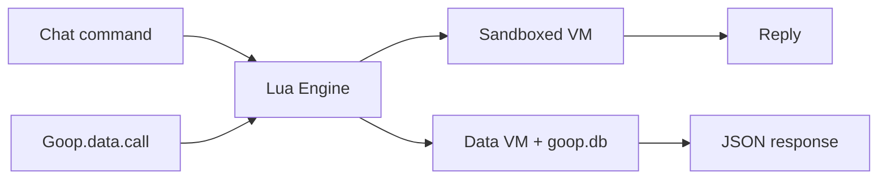
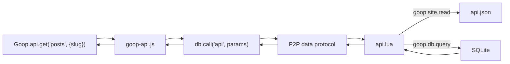
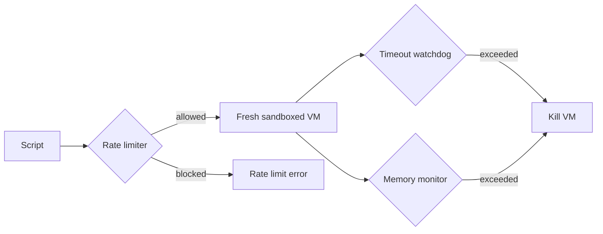

# Scripting with Lua

Goop2 includes an embedded Lua runtime that lets you add server-side logic to your peer. Lua scripts can power chat commands, validate data, compute scores, enforce game rules, and more.

## Enabling Lua

Add the `lua` section to your `goop.json`:

```json
{
  "lua": {
    "enabled": true,
    "script_dir": "site/lua",
    "timeout_seconds": 5,
    "max_memory_mb": 10
  }
}
```

Lua scripts come in two flavors: **chat commands** that respond to visitor messages, and **data functions** that provide server-side logic for templates.



## Script types

### Chat commands

Files in `site/lua/` (not in `functions/`) are chat commands. A visitor sends a direct message starting with `!` and the matching script runs.

File: `site/lua/hello.lua`

```lua
function handle(args)
    return "Hello, " .. (args ~= "" and args or "world") .. "!"
end
```

A visitor typing `!hello Alice` receives the response `Hello, Alice!`.

### Data functions

Files in `site/lua/functions/` are data functions. They are called from the browser via the `goop-data.js` library and return structured data.

File: `site/lua/functions/score-quiz.lua`

```lua
function call(request)
    local answers = request.params.answers
    local score = 0
    -- scoring logic here
    return { score = score, total = #answers }
end
```

Called from JavaScript:

```javascript
const result = await Goop.data.call("score-quiz", { answers: [...] });
```

## Available APIs

### goop.peer

Information about the calling peer:

```lua
goop.peer.id       -- Peer ID (e.g. "12D3Koo...")
goop.peer.label    -- Display name (if known)
```

### goop.self

Information about the local peer:

```lua
goop.self.id       -- Local peer ID
goop.self.label    -- Local display name
```

### goop.http

HTTP client (requires `http_enabled: true`):

```lua
local body, err = goop.http.get("https://api.example.com/data")
local body, err = goop.http.post("https://api.example.com/submit", {key = "val"})
```

Only `http://` and `https://` URLs are allowed. Requests to private/loopback addresses are blocked (SSRF protection with DNS pinning). Limited to 3 requests per invocation, 1 MB max response size.

### goop.json

JSON encoding and decoding:

```lua
local obj = goop.json.decode('{"name":"Alice"}')
local str = goop.json.encode({name = "Bob"})
```

### goop.kv

Persistent key-value store (per script, requires `kv_enabled: true`):

```lua
goop.kv.set("api_key", "secret123")
local key = goop.kv.get("api_key")
goop.kv.del("api_key")
```

Limited to 1000 keys and 64 KB total per script.

### goop.log

Logging:

```lua
goop.log.info("processing request")
goop.log.warn("API key missing")
goop.log.error("connection failed")
```

### goop.db

Raw SQL database access (data functions only):

```lua
local rows = goop.db.query("SELECT * FROM posts WHERE _owner = ?", goop.peer.id)
local count = goop.db.scalar("SELECT COUNT(*) FROM responses")
goop.db.exec("UPDATE games SET turn = ? WHERE _id = ?", "O", game_id)
```

### goop.schema

Typed ORM database access (data functions only). Works with tables created via `goop.schema.create` or through the ORM schema system:

```lua
goop.schema.create("scores", {
    {name = "player", type = "text", required = true},
    {name = "points", type = "integer", default = 0},
})

goop.schema.insert("scores", {player = "Alice", points = 100})

local row = goop.schema.get("scores", 1)
local all = goop.schema.list("scores", 10)

goop.schema.update("scores", 1, {points = 200})
goop.schema.delete("scores", 1)

local ok, err = goop.schema.validate("scores", {player = "Bob"})
local info = goop.schema.describe("scores")
local is_orm = goop.schema.is_orm("scores")
```

### goop.schema.find / find_one

Filtered queries with ordering, pagination, and field selection:

```lua
local rows = goop.schema.find("posts", {
    where = "published = 1",
    order = "_id DESC",
    limit = 10,
    fields = {"title", "slug"}
})

local row = goop.schema.find_one("posts", {
    where = "slug = ?",
    args = {"hello-world"}
})
-- returns the row directly (not an array), or nil
```

### goop.site

Read files from the site content store (data functions only):

```lua
local content, err = goop.site.read("api.json")
local config = goop.json.decode(content)
```

This enables a **virtual REST API pattern**: a data function reads `api.json` to configure which tables and operations are exposed, then dispatches CRUD requests based on those declarations.



Templates declare endpoints in `api.json`:

```json
{
  "posts": {
    "table": "posts",
    "slug": "slug",
    "filter": "published = 1",
    "get": true,
    "list": {"order": "_id DESC", "limit": 50}
  }
}
```

Without `api.json`, all tables are exposed with default CRUD. See the SDK documentation for `Goop.api` for the JavaScript side.

### goop.listen

Audio listening session control:

```lua
local group, err = goop.listen.create("My Session")
local state = goop.listen.state()
local track, err = goop.listen.load("/path/to/track.mp3")
goop.listen.play()
goop.listen.pause()
goop.listen.seek(30.5)
goop.listen.close()
```

### goop.commands()

Returns a list of all loaded chat commands.

## Script annotations

Scripts can include metadata annotations in leading `---` comments:

```lua
--- A weather lookup command
--- @rate_limit 10
function handle(args)
    -- ...
end
```

- **Description**: The first `---` line (not starting with `@`) becomes the script's description, shown in command listings.
- **`@rate_limit N`**: Override the per-peer rate limit for this script. `0` = unlimited, any positive number = custom per-peer-per-minute limit. Without this annotation, the global `rate_limit_per_peer` config applies.

## Security



Every Lua invocation runs in a fresh, sandboxed VM:

- **No filesystem access** -- `io`, `loadfile`, and `dofile` are disabled.
- **No module loading** -- `require` and `package` are disabled.
- **No shell execution** -- `os.execute`, `os.remove`, etc. are disabled.
- **Hard timeout** -- Default 5 seconds, configurable up to 60.
- **Memory limit** -- Default 10 MB per VM.
- **Rate limiting** -- Per-peer (30/min) and global (120/min) limits prevent abuse.

## Hot reload

Scripts are automatically reloaded when their files change. There is no need to restart the peer. If a script has a syntax error, the previous working version stays active and the error is logged.

## Example: weather command

```lua
function handle(args)
    if args == "" then return "Usage: !weather <city>" end

    local key = goop.kv.get("api_key")
    if not key then return "Weather API key not configured." end

    local url = "https://api.openweathermap.org/data/2.5/weather"
        .. "?q=" .. args .. "&appid=" .. key .. "&units=metric"

    local body, err = goop.http.get(url)
    if err then return "Error: " .. err end

    local data = goop.json.decode(body)
    return string.format("%s: %s C, %s",
        data.name,
        tostring(math.floor(data.main.temp)),
        data.weather[1].description)
end
```

## Example: game move validation

```lua
function call(request)
    local game_id = request.params.game_id
    local position = tonumber(request.params.position)

    local rows = goop.db.query("SELECT * FROM games WHERE _id = ?", game_id)
    if not rows or #rows == 0 then
        error("game not found")
    end

    local game = rows[1]
    if game.turn ~= goop.peer.id then
        return { error = "not your turn" }
    end

    local idx = position + 1
    if string.sub(game.board, idx, idx) ~= "-" then
        return { error = "cell occupied" }
    end

    local new_board = string.sub(game.board, 1, idx - 1)
                   .. "X"
                   .. string.sub(game.board, idx + 1)

    goop.db.exec("UPDATE games SET board = ?, turn = ? WHERE _id = ?",
        new_board, "O", game_id)

    return { board = new_board, turn = "O" }
end
```
