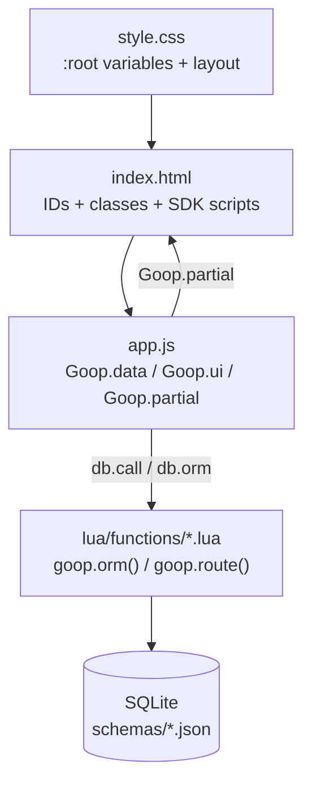

# JavaScript SDK

The Goop2 SDK is a set of JavaScript modules that templates load to interact with the peer. Each module is a single `<script>` tag served from `/sdk/` and attaches to the global `Goop` object.

## Building a template

### The workflow

1. **Build your site** using the Editor tab — write HTML, CSS, JS, upload images
2. **Test it live** by viewing your own peer (the View tab shows your site)
3. **Add a backend** — create Lua data functions in the Lua Scripts tab
4. **Define schemas** — add `schemas/*.json` for your database tables
5. **Publish** — add `manifest.json` and submit to the template store

Your site IS the template. Other peers install it by copying your files, creating your tables, and running your Lua scripts on their peer.

### File structure

```bash
my-template/
  index.html           HTML structure (IDs and classes for JS/CSS)
  css/style.css        Styling (CSS variables for SDK components)
  js/app.js            Behavior (reacts to IDs/classes, calls SDK)
  lua/functions/        Backend logic (called from JS via db.call)
  partials/            Reusable HTML fragments (rendered by JS)
  schemas/             ORM table definitions (JSON)
  images/              Static assets
  manifest.json        Template metadata
```

### How the layers connect



**HTML** defines the structure. Use IDs and classes as hooks — JS finds elements by ID, CSS styles them by class:

```html
<main id="gallery" class="gallery"></main>
<div id="toasts" class="gc-toast-container"></div>
<div id="confirm-dialog" class="gc-dialog-backdrop hidden">
  <div class="gc-dialog">
    <h2 class="gc-dialog-title">Confirm</h2>
    <div class="gc-dialog-body"><p class="gc-dialog-message"></p></div>
    <div class="gc-dialog-buttons">
      <button class="gc-dialog-cancel">Cancel</button>
      <button class="gc-dialog-ok">OK</button>
    </div>
  </div>
</div>
```

**CSS** styles everything. Define CSS variables in `:root` that SDK components pick up:

```css
:root {
  --bg: #1a1a2e;
  --panel: #16213e;
  --text: #e6e6e6;
  --muted: #8888aa;
  --accent: #e94560;
  --border: #2a2a4a;
}
```

SDK component CSS (dialog, toast, lightbox, etc.) uses these variables with light-theme fallbacks like `var(--panel, #fff)`. If a component looks wrong on your theme, add the missing variable to your `:root`.

**JS** wires up behavior. It reads the DOM by ID/class, detects who's viewing, and renders data:

```javascript
var db = Goop.data;
var ctx = await Goop.peer();
// ctx.isOwner — true if the viewer owns this site
// ctx.isGroup — true if the viewer is a group member
// ctx.myId    — viewer's peer ID
// ctx.hostId  — site owner's peer ID

var r = await Goop.data.role("posts");
// r.role        — "owner", "coauthor", "viewer", or ""
// r.permissions — {read: true, insert: true, update: true, delete: false}

if (ctx.isOwner) document.getElementById("admin-panel").classList.remove("hidden");
```

**Lua** handles server-side logic. JS calls Lua via `db.call()`, Lua reads/writes the database, returns JSON:

```javascript
var result = await db.call("myapp", { action: "get_items" });
```

### When to use JS ORM vs Lua

- **JS ORM** (`db.orm("table")`) — simple CRUD that doesn't need server-side logic. Good for: reading lists, inserting user-submitted data, basic updates. Access is controlled by the schema's `access` policy.
- **Lua** (`db.call("function", {})`) — business logic, validation, multi-table operations, owner-only actions, anything that needs server-side rules. Good for: game moves, position swaps, computed fields, authorization checks.

### Schemas

Each table is defined in `schemas/<name>.json`:

```json
{
  "name": "cards",
  "system_key": true,
  "columns": [
    {"name": "title", "type": "text", "required": true},
    {"name": "position", "type": "integer", "default": 0},
    {"name": "color", "type": "text", "default": ""}
  ],
  "access": {
    "read": "open",
    "insert": "group",
    "update": "owner",
    "delete": "owner"
  }
}
```

**`system_key: true`** means the system manages the `_id` column (auto-increment integer) and adds `_owner`, `_created_at`, `_updated_at` columns automatically. Always use this for template tables.

**Column types**: `text`, `integer`, `real`, `blob`, `enum`.

**Access policies** control who can perform each operation:

| Policy | Meaning |
|--------|---------|
| `open` | Anyone can do this (even non-members) |
| `group` | Only group members and the site owner |
| `owner` | Only the row's creator (`_owner`) or the site owner |
| `local` | Only the site owner (server-side only) |

### Partials

HTML fragments in `partials/` are rendered by JS. File name = partial name.

File: `partials/card.html`

```html
<div class="card" data-card-id="{{_id}}" data-color="{{color}}">
  <div class="card-title">{{title}}</div>
  {{#if description}}
  <div class="card-desc">{{description}}</div>
  {{/if}}
</div>
```

Used from JS:

```javascript
var el = await Goop.partial("card", { _id: 1, title: "Task", color: "#ff0" });
container.appendChild(el);

// Or render a list:
await Goop.list(container, rows, "card", { empty: "No cards yet." });
```

Syntax: `{{name}}` (escaped), `{{{name}}}` (raw HTML), `{{#if name}}...{{/if}}`, `{{#each items}}...{{/each}}`, `{{#unless name}}...{{/unless}}`.

### Seed data

To populate initial data when the template is installed, add `lua/functions/seed.lua`:

```lua
function call(req)
  local cols = goop.orm("columns")
  local n = cols:seed({
    { name = "To Do",       position = 0, color = "#6366f1" },
    { name = "In Progress", position = 1, color = "#f59e0b" },
    { name = "Done",        position = 2, color = "#22c55e" },
  })
  return n
end
```

The seed function runs once after the template tables are created.

### Manifest

`manifest.json` registers the template:

```json
{
  "name": "Kanban",
  "description": "A shared team kanban board",
  "category": "productivity",
  "icon": "...",
  "schemas": ["columns", "cards", "kanban_config"]
}
```

The `schemas` field lists table names that this template owns. On uninstall, only these tables are dropped.

### Minimal complete example

A working notes template in 4 files:

**schemas/notes.json**
```json
{
  "name": "notes",
  "system_key": true,
  "columns": [
    {"name": "text", "type": "text", "required": true}
  ],
  "access": {"read": "open", "insert": "owner", "update": "owner", "delete": "owner"}
}
```

**index.html**
```html
<!doctype html>
<html><head>
  <script src="/sdk/goop-data.js"></script>
  <script src="/sdk/goop-component-base.js"></script>
</head><body>
  <h1>Notes</h1>
  <div id="notes"></div>
  <input id="input" placeholder="Add a note...">
  <button id="add">Add</button>
  <script src="js/app.js"></script>
</body></html>
```

**js/app.js**
```javascript
(async function() {
  var db = Goop.data;
  var notes = await db.orm("notes");
  var ctx = await Goop.peer();
  var list = document.getElementById("notes");

  async function load() {
    var rows = await notes.find({ order: "_id DESC" }) || [];
    Goop.render(list);
    rows.forEach(function(r) {
      list.appendChild(Goop.dom("p", {}, r.text));
    });
  }

  if (ctx.isOwner) {
    document.getElementById("add").onclick = async function() {
      var text = document.getElementById("input").value.trim();
      if (!text) return;
      await notes.insert({ text: text });
      document.getElementById("input").value = "";
      load();
    };
  } else {
    document.getElementById("input").style.display = "none";
    document.getElementById("add").style.display = "none";
  }

  load();
})();
```

**manifest.json**
```json
{"name": "Notes", "description": "Simple notes", "category": "productivity", "schemas": ["notes"]}
```

That's a complete, installable template. No Lua needed — the JS ORM handles simple CRUD directly.

## Loading

```html
<link rel="stylesheet" href="/sdk/goop-component-toast.css">
<link rel="stylesheet" href="/sdk/goop-component-dialog.css">
<script src="/sdk/goop-data.js"></script>
<script src="/sdk/goop-identity.js"></script>
<script src="/sdk/goop-component-base.js"></script>
<script src="/sdk/goop-component-toast.js"></script>
<script src="/sdk/goop-component-dialog.js"></script>
<script src="/sdk/goop-component-template.js"></script>
<script src="js/app.js"></script>
```

Load only what you need. Each component has a matching CSS file. Always load `goop-component-base.js` before other components.

The SDK auto-detects whether the template is running on the local peer (`/`) or viewing a remote peer (`/p/<peerID>/`), and routes API calls to the correct peer transparently.

## Modules

| Module | Global | Purpose |
|--------|--------|---------|
| `goop-data.js` | `Goop.data` | Database CRUD, ORM, Lua calls, config, overlays |
| `goop-identity.js` | `Goop.identity` | Peer ID, display name, email |
| `goop-site.js` | `Goop.site` | File storage (read, upload, delete) |
| `goop-group.js` | `Goop.group` | Group MQ messaging (join, send, subscribe) |
| `goop-mq.js` | `Goop.mq` | General MQ bus subscription (SSE) |
| `goop-peers.js` | `Goop.peers` | Peer discovery and status polling |
| `goop-chat.js` | `Goop.chat` | Direct and broadcast chat over MQ |
| `goop-realtime.js` | `Goop.realtime` | Virtual MQ-based channels |
| `goop-call.js` | `Goop.call` | Audio/video calling |
| `goop-api.js` | `Goop.api` | Virtual REST API over Lua data functions |
| `goop-template.js` | `Goop.template` | Template settings (require_email, etc.) |
| `goop-form.js` | `Goop.form` | JSON-driven form renderer |
| `goop-forms.js` | `Goop.forms` | Auto-generated CRUD UI from schema |
| `goop-engine.js` | `GameLoop, Renderer, ...` | 2D game engine (Canvas) |

## Utilities (from goop-data.js)

`goop-data.js` also provides these helpers on the `Goop` global:

```javascript
var ctx = await Goop.peer();
// ctx.myId    — this viewer's peer ID
// ctx.hostId  — site owner's peer ID
// ctx.isOwner — true when viewing your own site
// ctx.isGroup — true when viewer is a group member
// ctx.label   — viewer's display name

var formatted = Goop.date(timestamp);  // "April 2, 2026"
var safe = Goop.esc(userInput);        // HTML-escaped string

var overlay = Goop.overlay("my-overlay-id");
overlay.open();   // removes .hidden, focuses first input
overlay.close();  // adds .hidden
```

## Component Library

Each component is a separate JS + CSS file pair. Load `goop-component-base.js` first.

| Component file | Provides | Key options |
|---|---|---|
| `goop-component-base.js` | `Goop.dom()`, `Goop.render()`, `Goop.list()`, `Goop.ui.empty()`, `Goop.ui.theme()`, grid | Required by all components |
| `goop-component-template.js` | `Goop.partial()`, `Goop.preload()` | Mustache-like partials from `partials/` dir |
| `goop-component-toast.js` | `Goop.ui.toast(el, opts)` | toastClass, titleClass, messageClass, duration |
| `goop-component-dialog.js` | `Goop.ui.dialog(el, opts)` => `.confirm()`, `.prompt()`, `.alert()`, `.confirmDanger()` | title, message, input, ok, cancel, hiddenClass |
| `goop-component-lightbox.js` | `Goop.ui.lightbox(el, opts)` | img, prev, next, close, caption, openClass, hiddenClass |
| `goop-component-drag.js` | `Goop.drag.sortable(el, opts)` | items, handle, group, direction, onEnd |
| `goop-component-colorpicker.js` | `Goop.ui.colorpicker(el, opts)` | colors, value, swatch, popup |
| `goop-component-toolbar.js` | `Goop.ui.toolbar(el, opts)` | idAttr, activeClass, active, onChange |
| `goop-component-datepicker.js` | `Goop.ui.datepicker(el, opts)` | value, time, min, max, format |
| `goop-component-select.js` | `Goop.ui.select(el, opts)` | options, value, multi, searchable |
| `goop-component-tabs.js` | `Goop.ui.tabs(el, opts)` | tabs, active |
| `goop-component-accordion.js` | `Goop.ui.accordion(el, opts)` | sections, multi, open |
| `goop-component-taginput.js` | `Goop.ui.taginput(el, opts)` | value, placeholder, max, suggestions |
| `goop-component-stepper.js` | `Goop.ui.stepper(el, opts)` | value, min, max, step |
| `goop-component-carousel.js` | `Goop.ui.carousel(el, opts)` | slides, autoplay, loop, dots, arrows |
| `goop-component-sidebar.js` | `Goop.ui.sidebar(opts)` | title, side, width, overlay |
| `goop-component-badge.js` | `Goop.ui.badge(text, opts)` | variant, dot |
| `goop-component-progress.js` | `Goop.ui.progress(el, opts)` | value, max, variant, animated |
| `goop-component-pagination.js` | `Goop.ui.pagination(el, opts)` | total, page, perPage |
| `goop-component-tooltip.js` | `Goop.ui.tooltip(el, opts)` | text, position |
| `goop-component-panel.js` | `Goop.ui.panel()`, `.scrollbox()`, `.splitpane()` | collapsible, variant |

### Goop.dom (from base.js)

Build DOM elements without innerHTML:

```javascript
var h = Goop.dom;
var card = h("div", { class: "card", data: { id: row._id } },
  h("h3", {}, row.title),
  h("p", { class: "muted" }, row.description),
  ctx.isOwner ? h("button", { onclick: deleteCard }, "Delete") : null
);
Goop.render(container, card);
```

### Goop.ui.toast

```javascript
var toast = Goop.ui.toast(document.getElementById("toasts"), {
  toastClass: "gc-toast",
  titleClass: "gc-toast-title",
  messageClass: "gc-toast-message",
  enterClass: "gc-toast-enter",
  exitClass: "gc-toast-exit",
});

toast("Saved!");
toast({ title: "Error", message: "Something went wrong" });
```

### Goop.ui.dialog

```javascript
Goop.ui.dialog(document.getElementById("confirm-dialog"), {
  title: ".gc-dialog-title",
  message: ".gc-dialog-message",
  inputWrap: ".gc-dialog-input-wrap",
  input: ".gc-dialog-input",
  ok: ".gc-dialog-ok",
  cancel: ".gc-dialog-cancel",
  hiddenClass: "hidden",
});

var ok = await Goop.ui.confirm("Delete this item?");
var name = await Goop.ui.prompt({ title: "Rename", message: "New name:", value: "old" });
await Goop.ui.alert("Done", "Operation completed.");
```

## Goop.data

Database access and Lua function calls. Works in both local and remote peer context.

### ORM handle (recommended for simple CRUD)

```javascript
var db = Goop.data;
var posts = await db.orm("posts");

var rows = await posts.find({ where: "published = 1", order: "_id DESC", limit: 10 });
var row = await posts.findOne({ where: "slug = ?", args: ["hello"] });
var post = await posts.get(42);
var bySlug = await posts.getBy("slug", "hello");
var titles = await posts.pluck("title");
var n = await posts.count({ where: "published = 1" });
var exists = await posts.exists({ where: "slug = ?", args: ["hello"] });

var result = await posts.insert({ title: "New", body: "Content" });
await posts.update(42, { title: "Updated" });
await posts.remove(42);
await posts.updateWhere({ published: 1 }, { where: "draft = 0" });
await posts.deleteWhere({ where: "archived = 1" });
await posts.upsert("slug", { slug: "hello", title: "Hello" });
```

The ORM handle also exposes `posts.columns`, `posts.access`, `posts.canInsert`, `posts.canUpdate`, `posts.canDelete`, `posts.validate(data)`, `posts.form(el, opts)`, and `posts.table(el, rows, opts)`.

### Role query

Ask the host for your role and permissions on a specific schema:

```javascript
var r = await db.role("posts");
// r.role        — "owner", "coauthor", "viewer", or "" (not a member)
// r.permissions — {read: true, insert: true, update: true, delete: false}
```

The host is the authority — it looks up the caller's role in the template group and checks it against the schema's roles map. Use this for UI gating (show/hide buttons based on what the caller can actually do).

### Calling Lua functions (for business logic)

```javascript
var result = await db.call("kanban", { action: "get_board" });
```

The second argument becomes `request.params` in Lua. The return value is the Lua function's return table, as JSON. See the Lua guide for the server side.

### API helper

Shorthand for Lua functions that use `goop.route()`. Inserts `action` automatically:

```javascript
var blog = Goop.data.api("blog");
// blog("get_posts", {limit: 10}) calls db.call("blog", {action: "get_posts", limit: 10})
var result = await blog("get_posts", { limit: 10 });
await blog("save_config", { key: "title", value: "My Blog" });
```

### Config helper

```javascript
var cfg = await db.config("settings", { theme: "light", accent: "#6366f1" });
cfg.theme;                          // reads current value
await cfg.set("theme", "dark");     // persists to DB
```

Works with key-value tables (columns: `key`, `value`) or single-row tables.

### Direct CRUD (without ORM handle)

```javascript
var rows = await db.find("tasks", { limit: 10, where: "score > ?", args: [5] });
var result = await db.insert("tasks", { title: "Hello", score: 9.5 });
await db.update("tasks", id, { score: 10 });
await db.remove("tasks", id);
var tables = await db.tables();
var schemas = await db.schemas();
```

## Goop.identity

```javascript
var info  = await Goop.identity.get();    // {id, label, email}
var myId  = await Goop.identity.id();     // peer ID string
var name  = await Goop.identity.label();  // display name
var email = await Goop.identity.email();  // email string
```

## Goop.template

Template settings declared in the manifest and stored on the host peer.

```javascript
var settings = await Goop.template.get();           // {require_email: true/false}
var needsEmail = await Goop.template.requireEmail(); // boolean
```

## Goop.site

File storage for the peer's site content directory.

```javascript
var files = await Goop.site.files();
var content = await Goop.site.read("data.json");
await Goop.site.upload("images/photo.jpg", file);
await Goop.site.remove("images/old.jpg");
```

## Goop.group

MQ messaging for real-time group communication. Group management (create, close, add/remove members) is done server-side through Lua via `goop.group.*`.

```javascript
var subs = await Goop.group.subscriptions();
await Goop.group.join(hostPeerId, groupId);
await Goop.group.send({ type: "chat", text: "hello" }, groupId);
await Goop.group.leave();

var es = Goop.group.subscribe(function(evt) {
  // evt.type: "welcome", "members", "msg", "state", "leave", "close", "invite"
});
Goop.group.unsubscribe();
```

## Goop.mq

General MQ bus subscription via SSE. Receives all MQ events including group lifecycle, chat broadcasts, and custom topics.

```javascript
Goop.mq.subscribe(function(evt) {
  // evt.type — "message" or "delivered"
  // evt.msg  — {topic, payload, id, seq}
  // evt.from — sender peer ID
  if (evt.msg && evt.msg.topic.startsWith("group:") && evt.msg.topic.endsWith(":close")) {
    loadRooms();
  }
});
Goop.mq.unsubscribe();
```

## Goop.peers

```javascript
var peers = await Goop.peers.list();
Goop.peers.subscribe({
  onSnapshot(peers) { },
  onUpdate(peerId, peer) { },
  onRemove(peerId) { }
}, 5000);
Goop.peers.unsubscribe();
```

## Goop.chat

```javascript
await Goop.chat.send(peerId, "Hello!");
await Goop.chat.broadcast("Server restarting");
Goop.chat.subscribe(function(msg) { /* msg: {from, content, type, timestamp} */ });
```

## Goop.realtime

```javascript
var ch = await Goop.realtime.connect(peerId);
ch.send({ action: "ping" });
ch.onMessage(function(msg, env) { });
ch.close();
```

## Goop.call

```javascript
var session = await Goop.call.start(peerId, { video: true, audio: true });
session.onRemoteStream(function(stream) { video.srcObject = stream; });
session.hangup();

Goop.call.onIncoming(function(info) {
  var session = await info.accept({ video: true });
});
```

## Goop.drag

```javascript
var instance = Goop.drag.sortable(container, {
  items: ".card",
  handle: ".drag-handle",
  group: "kanban",
  direction: "vertical",
  onEnd: function(evt) { /* evt: {item, from, to, oldIndex, newIndex} */ }
});
instance.destroy();
```

## Goop Engine

2D game engine for Canvas-based templates. Exposes global classes (not under `Goop`).

```javascript
var loop = new GameLoop(60);
loop.start(update, render);

var renderer = new Renderer(canvas);
renderer.clear("#000");
renderer.drawRect(x, y, w, h, color);
renderer.drawSprite(image, sx, sy, sw, sh, dx, dy, dw, dh);
renderer.drawText(text, x, y, font, color, align);

var input = new Input();
input.bind(canvas);

var scenes = new SceneManager();
scenes.add("menu", { enter(){}, update(dt){}, render(r){}, exit(){} });
scenes.switch("menu");
```
