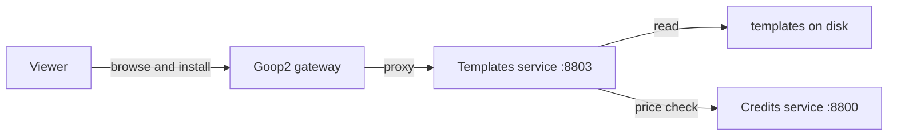
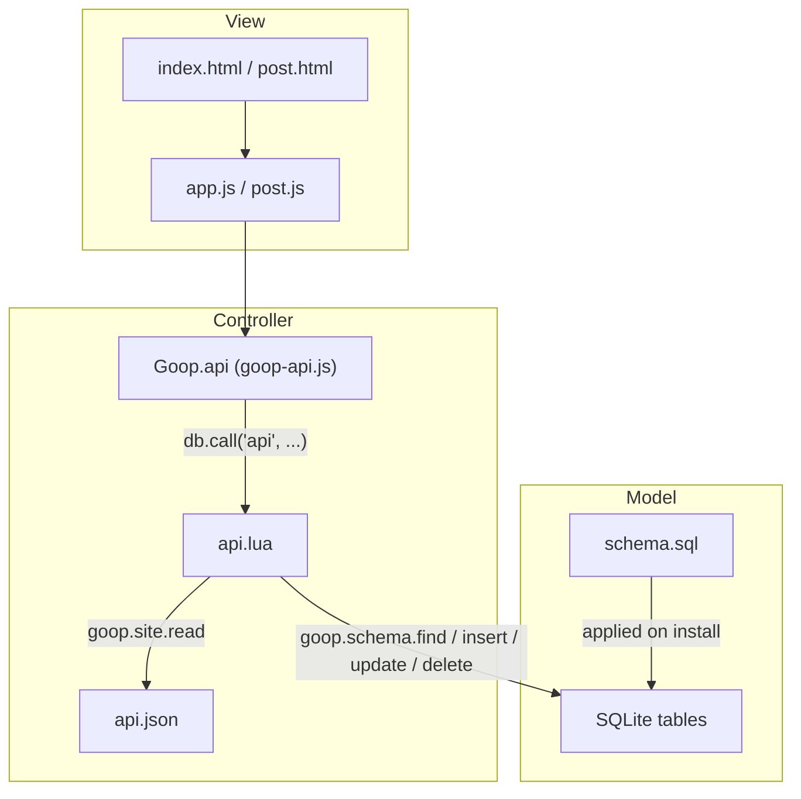

# Templates

Templates are pre-built applications that turn a Goop2 peer into a specific kind of site -- a blog, a quiz, a game, or anything else. Each template bundles HTML, CSS, JavaScript, a database schema, and optional Lua logic into a package that works out of the box.

## How templates work

A template lives in a directory with the following structure:

```
templates/
  my-template/
    manifest.json      # Metadata (name, description, icon, category)
    schema.sql         # SQLite schema (tables, indexes)
    api.json           # Virtual API endpoint declarations (optional)
    index.html         # Frontend UI
    post.html          # Detail page (optional, query-param driven)
    css/style.css      # Template-specific styles
    js/app.js          # Client-side logic
    lua/functions/     # Server-side Lua logic (optional)
      api.lua          # Virtual REST API (reads api.json)
```

When you apply a template, Goop2 copies the template files into your `site/` directory and initializes the database schema. You can do this from the viewer's **Create > Templates** page.

## Built-in templates

These templates ship with every Goop2 peer and are always available:

### Blog

A personal blog where you and invited co-authors can write posts. Visitors see a read-only feed.

- **Category**: Content
- **Access**: `group` insert for posts, `owner` for blog config
- **Roles**: `editor` (read, insert, update, delete), `viewer` (read)

### Enquete

A simple survey application. Visitors answer questions and responses are collected in the owner's database. Requires viewers to have an email address configured.

- **Category**: Community
- **Access**: `open` insert for responses
- **Settings**: `require_email: true`

### Tic-Tac-Toe

A multiplayer tic-tac-toe game with server-side Lua enforcing the rules. Visitors can challenge the host or play against the computer.

- **Category**: Games
- **Access**: `open` insert for game creation

### Clubhouse

A real-time group chat room. Uses the groups protocol for live messaging between peers.

- **Category**: Community

## Template store

Additional templates are available through the **template store** on a rendezvous server. Store templates are served by the **templates microservice** -- a separate service from the [goop2-services](https://github.com/petervdpas/goop2-services) repository. Templates are loaded from disk by the templates service, not embedded in any binary. The rendezvous server proxies requests to it when `templates_url` is configured with `use_services` enabled.

Templates can be browsed and installed from the viewer's **Create > Templates** page or from the rendezvous server's `/store` page.



Current store templates include:

| Template | Category | Description |
|----------|----------|-------------|
| **Quiz** | Community | A multiple-choice quiz with server-side scoring |
| **Space Invaders** | Games | Classic arcade shooter -- defend Earth from alien invaders |
| **Chess** | Games | Classic chess -- challenge visitors or play against the computer |
| **Corkboard** | Community | Community advertisement board -- pin notes, pushpins, color-coded cards |
| **Day Trader** | Finance | Real-time price charts for any trading instrument with configurable symbols and API |
| **Kanban** | Productivity | A shared team kanban board -- owner manages columns, co-authors collaborate on cards |
| **Photobook** | Content | A personal photo gallery with albums and lightbox |
| **Blog 2.0** | Content | MVC blog with virtual REST API, article detail pages, themed design. Requires `goop-api.js` SDK |

When a credits service is also configured, store templates can be priced. Peers need sufficient credits to download priced templates.

### Local template store

If you don't want to run the templates microservice, you can serve templates directly from a local directory by setting `templates_dir` in your rendezvous config:

```json
{
  "presence": {
    "templates_dir": "templates"
  }
}
```

Each subdirectory needs a `manifest.json`. This fallback is used when `templates_url` is empty or `use_services` is false. Local templates are always free.

### Store API

The rendezvous server proxies these endpoints to the templates service (or serves them from the local directory):

| Endpoint | Method | Purpose |
|----------|--------|---------|
| `/store` | GET | Template store web page |
| `/api/templates` | GET | JSON list of available templates |
| `/api/templates/<name>/manifest` | GET | Template metadata |
| `/api/templates/<name>/bundle` | GET | Download template as tar.gz |

## Access policies

Each schema defines per-operation access policies for read, insert, update, and delete:

| Policy | Who is allowed |
|--------|---------------|
| `local` | Only the local node process. |
| `owner` | Only the site owner. |
| `group` | Group members, checked against the schema's role access matrix. |
| `open` | Any peer. |

Access is defined in the schema JSON, not the manifest:

```json
{
  "name": "posts",
  "access": {
    "read": "open",
    "insert": "group",
    "update": "group",
    "delete": "owner"
  }
}
```

### Roles

When any access policy is set to `group`, the schema can define a roles map. Each role specifies which operations it permits. The owner always has full access.

```json
{
  "name": "posts",
  "access": { "read": "open", "insert": "group", "update": "group", "delete": "owner" },
  "roles": {
    "editor": { "read": true, "insert": true, "update": true, "delete": true },
    "viewer": { "read": true }
  }
}
```

If any schema in a template uses `group` access or defines roles, Goop2 automatically creates a co-author group when the template is applied. Re-applying the same template preserves existing group members.

### Template settings

The manifest supports template-level settings that are separate from access policies:

| Setting | Type | Description |
|---------|------|-------------|
| `require_email` | `bool` | Template requires viewers to have an email address configured. |

```json
{
  "name": "Enquete",
  "require_email": true,
  "schemas": ["responses"]
}
```

Template settings are available to both Lua (`goop.template.require_email`) and JS (`Goop.template.requireEmail()`).

## Remote data

Templates work the same whether a visitor is viewing the site locally or remotely. The `goop-data.js` client library detects the context and routes data operations accordingly:

- **Local** (`/site/index.html`): Data operations go directly to the local database.
- **Remote** (`/p/<peerID>/index.html`): Data operations are proxied over a P2P stream to the remote peer's database.

The same template code handles both cases transparently.

## Creating a custom template

To create a template for the store, create a directory in the templates service's `templates_dir`:

1. Add a `manifest.json` with metadata and table policies.
2. Write your `index.html`, `css/style.css`, and `js/app.js`.
3. Include `<script src="/sdk/goop-data.js"></script>` for database access.
4. Optionally add `schema.sql` for database tables.
5. Optionally add Lua functions in `lua/functions/` for server-side logic.
6. Optionally add `api.json` for virtual REST API endpoints (see below).

The template will appear in the store and can be installed by any peer connected to that rendezvous server. The templates service supports `extra_dirs` in its config for loading templates from multiple directories.

### MVC pattern with api.json

Templates can follow an MVC architecture using a declarative virtual REST API:

- **Model**: `schema.sql` defines tables, `manifest.json` defines policies
- **View**: HTML pages + JS that call `Goop.api` methods
- **Controller**: `api.json` declares endpoints, `api.lua` handles routing



The `api.json` file declares which tables are exposed and how:

```json
{
  "posts": {
    "table": "posts",
    "slug": "slug",
    "filter": "published = 1",
    "fields": ["title", "body", "author_name", "slug"],
    "get": true,
    "list": {"order": "_id DESC", "limit": 50},
    "insert": true, "update": true, "delete": true
  },
  "config": {
    "table": "blog_config",
    "map": {"key": "key", "value": "value"}
  }
}
```

Without `api.json`, the API falls back to exposing all tables with default CRUD. See the SDK documentation for `Goop.api` and the Lua scripting page for `goop.schema.find`.
