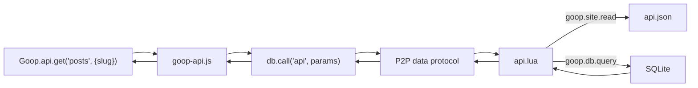

# Scripting with Lua

Goop2 includes an embedded Lua runtime for server-side logic. Scripts run in sandboxed VMs with no filesystem or network access beyond the provided APIs.

## Script types

### Chat commands

Files in `site/lua/` are chat commands. A visitor sends `!name args` and the script runs.

```lua
-- site/lua/hello.lua
function handle(args)
    return "Hello, " .. (args ~= "" and args or "world") .. "!"
end
```

### Data functions

Files in `site/lua/functions/` are data functions called from JavaScript via `Goop.data.call()`.

```lua
-- site/lua/functions/score.lua
function call(request)
    local answers = request.params.answers
    local score = 0
    -- scoring logic
    return { score = score, total = #answers }
end
```

## goop.db — Database access

Available in data functions only. Raw SQL access to the peer's SQLite database.

```lua
-- Query rows (returns array of tables)
local rows, err = goop.db.query("SELECT * FROM posts WHERE _owner = ?", goop.peer.id)

-- Single value
local count, err = goop.db.scalar("SELECT COUNT(*) FROM posts")

-- Write (INSERT, UPDATE, DELETE) — returns rows affected
local n, err = goop.db.exec("UPDATE posts SET title = ? WHERE _id = ?", "New title", 42)
```

## goop.schema — Typed ORM

Schema-aware database operations with type validation. No SQL needed.

```lua
-- Define a typed table
goop.schema.create("tasks", {
  {name="id",    type="integer", key=true},
  {name="title", type="text",    required=true},
  {name="status",type="text",    default="pending"},
  {name="score", type="real"}
})

-- Insert (validates types, returns _id)
local id, err = goop.schema.insert("tasks", {title="Build ORM", score=9.5})

-- Get by _id
local task, err = goop.schema.get("tasks", id)

-- List all (optional limit)
local all, err = goop.schema.list("tasks")
local top5, err = goop.schema.list("tasks", 5)

-- Update by _id (validates types)
goop.schema.update("tasks", id, {status="done", score=10})

-- Delete by _id
goop.schema.delete("tasks", id)

-- Introspection
local is_orm = goop.schema.is_orm("tasks")       -- true/false
local schema = goop.schema.describe("tasks")      -- {name, columns}
local ok, err = goop.schema.validate("tasks", {score="bad"})  -- false, "expects real"
```

Column types: `text`, `integer`, `real`, `blob`. System columns (`_id`, `_owner`, `_created_at`, `_updated_at`) are added automatically.

## goop.site — Site file access

Read files from the site content store. Available in data functions only.

```lua
local content, err = goop.site.read("api.json")
if not content then
    error("failed to read: " .. err)
end
local config = goop.json.decode(content)
```

### Virtual REST API pattern

A data function can read `api.json` to serve as a declarative REST API over your tables. The template defines endpoints in JSON; the Lua function handles routing.



```json
{
  "posts": {
    "table": "posts",
    "slug": "slug",
    "filter": "published = 1",
    "get": true,
    "list": {"order": "_id DESC", "limit": 50}
  }
}
```

The Lua function reads this config once, caches it, and dispatches `get`, `list`, `insert`, `update`, `delete`, and `map` actions based on the declarations. Without `api.json`, all tables are exposed with default CRUD.

## goop.http

```lua
local body, err = goop.http.get("https://api.example.com/data")
local body, err = goop.http.post("https://api.example.com/submit", {key = "val"})
```

Only `http://` and `https://` URLs. Private/loopback addresses are blocked (SSRF-safe with DNS pinning). Limited to 3 requests per invocation, 1 MB max response size.

## goop.json

```lua
local obj = goop.json.decode('{"name":"Alice"}')
local str = goop.json.encode({name = "Bob"})
```

## goop.kv

Persistent key-value store (per script, max 1000 keys / 64 KB).

```lua
goop.kv.set("counter", 42)
local val = goop.kv.get("counter")
goop.kv.del("counter")
```

## goop.peer / goop.self

```lua
goop.peer.id       -- Caller's peer ID
goop.peer.label    -- Caller's display name
goop.self.id       -- This node's peer ID
goop.self.label    -- This node's display name
```

## goop.log

```lua
goop.log.info("processing request")
goop.log.warn("API key missing")
goop.log.error("connection failed")
```

## goop.listen

Audio listening room control.

```lua
local state, err = goop.listen.state()
goop.listen.create("My Room")
goop.listen.load("/music/track.mp3")
goop.listen.play()
goop.listen.pause()
goop.listen.seek(30.5)
goop.listen.close()
```

## goop.commands()

Returns a list of all loaded chat command names.

```lua
local cmds = goop.commands()  -- {"hello", "ping", "weather"}
```

## Script annotations

Scripts can include metadata in leading `---` comments:

```lua
--- A weather lookup command
--- @rate_limit 10
function handle(args)
    -- ...
end
```

- First `---` line (not `@`-prefixed) becomes the script description, shown in command listings.
- `@rate_limit N` overrides the per-peer rate limit. `0` = unlimited, `N>0` = custom per-peer-per-minute limit.

## Security

- Each invocation runs in a **fresh sandboxed VM**
- No filesystem access (`io`, `loadfile`, `dofile` disabled)
- No module loading (`require` disabled)
- No shell execution (`os.execute` disabled)
- Hard timeout (default 5s, max 60s)
- Memory limit (default 10 MB per VM)
- Rate limiting: 30/min per peer, 120/min global

## Hot reload

Scripts are automatically reloaded when files change. No restart needed. Syntax errors keep the previous working version active.
